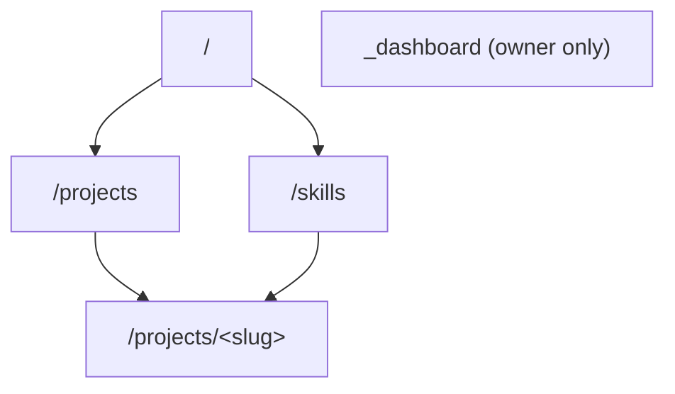
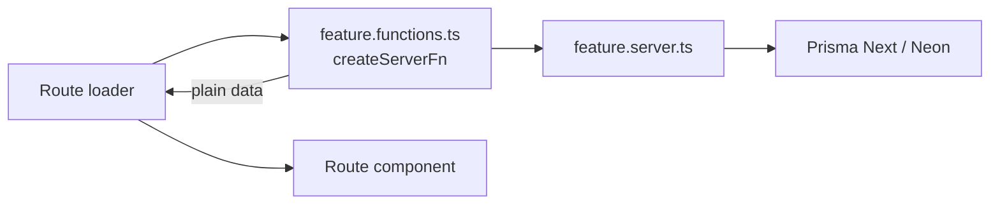

# Architecture

How the application is structured and how new code should fit in. The stack is recorded in [decision 0006](decisions/0006-tanstack-start-application-stack.md) and the folder layout in [decision 0009](decisions/0009-feature-folder-structure.md).

## Stack and entry points

A TypeScript React app on TanStack Start, running on Node.js in production ([decision 0005](decisions/0005-vercel-deployment.md)): TanStack Router for file-based routes, TanStack Query for client data, the React compiler, Tailwind CSS, and Nitro for server output. All of it is configured in [../vite.config.ts](../vite.config.ts).

| File | Owns |
| --- | --- |
| [../src/router.tsx](../src/router.tsx) | `getRouter()`: router plus a fresh QueryClient per request, wired for SSR |
| [../src/routes/__root.tsx](../src/routes/__root.tsx) | HTML document, metadata, stylesheets, scripts, devtools |
| `src/routes/_public/route.tsx` | Public layout: navbar, page outlet, footer, intro curtain, coming-soon redirect |
| `src/routes/_dashboard/` | Admin layout and pages |
| [../src/routeTree.gen.ts](../src/routeTree.gen.ts) | Generated from the route files; never edit by hand |

## Planned routes

Route groups that start with `_` (`_public`, `_dashboard`) are pathless layouts and do not appear in URLs.

| URL | Route file | Purpose |
| --- | --- | --- |
| `/` | `_public/index.tsx` | Hero, description, 3 featured projects, 3 top skill categories, contact links, resume download |
| `/projects` | `_public/projects/index.tsx` | All published projects |
| `/projects/<slug>` | `_public/projects/$slug.tsx` | Case study for one project |
| `/skills` | `_public/skills.tsx` | Skill categories and skills, each linked to the projects that use them |
| `/coming-soon` | `coming-soon.tsx` | Holding page while the site is gated; `noindex` |
| Admin URLs | `_dashboard/…` | Sign-in and create/edit screens for projects and skills, owner only. Exact URLs to be decided with the admin work. |



## Coming-soon gate

While the site is not ready, public pages redirect to `/coming-soon`. The owner can bypass the gate with a preview cookie:

| `COMING_SOON` | `preview` cookie matches `PREVIEW_TOKEN` | Result |
| --- | --- | --- |
| not `"true"` | any | Site is public; `/coming-soon` redirects to `/` |
| `"true"` | yes | Site is visible to that browser |
| `"true"` | no | Public pages redirect to `/coming-soon` |

```ts
// src/features/site/site.functions.ts (intended logic)
const comingSoon = process.env.COMING_SOON === "true";
const token = process.env.PREVIEW_TOKEN;
const hasPreview = !!token && getCookie("preview") === token;
return { gated: comingSoon && !hasPreview };
```

The gate is not authentication. Admin pages use Neon Auth ([intent](intent.md#answered-questions)).

## Data flow

Pages load data through route loaders that call server functions. Server functions call server-only modules, which own all database access.



- A server function returns plain, serializable data. Components render it during SSR and hydrate on the client. React Server Components are not used for now ([decision 0011](decisions/0011-no-react-server-components.md)).
- Load independent sections in parallel (`Promise.all` in the loader).
- UI never imports `*.server.ts` directly; TanStack Start blocks it from the client bundle.

## Folder ownership

| Location | Responsibility |
| --- | --- |
| `src/routes/` | URLs, loaders, page composition |
| `src/features/<feature>/` | Feature code: `.server.ts`, `.functions.ts`, `utils`, `types`, `components/` ([0009](decisions/0009-feature-folder-structure.md)) |
| `src/components/`, `src/components/ui/` | Shared components and shadcn primitives |
| `src/lib/` | Shared utilities |
| `src/integrations/` | Prisma runtime and contract, TanStack Query wiring, GSAP setup (`animations/`) |
| `src/styles.css`, `src/styles/` | Global styles and tokens ([ui](ui.md)) |
| `migrations/` | Prisma Next migrations ([data](data.md)) |
| `vercel.json` | Vercel settings ([0005](decisions/0005-vercel-deployment.md)) |

Expected features: `public` (landing page), `projects`, `skills`, `site` (gate), and an admin feature for the dashboard.
