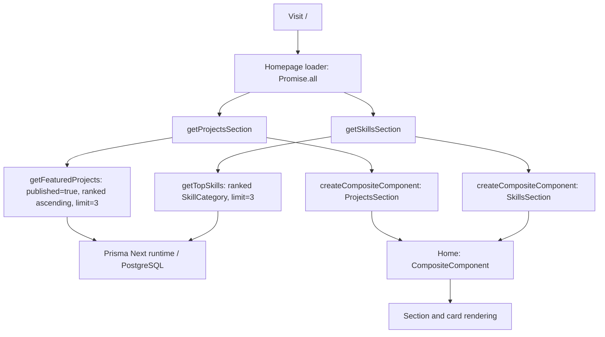

# Architecture

Source snapshot: **2026-10-05**. See [current status](status.md) for implementation gaps.

## Stack and entry points

This is a TypeScript React portfolio. The root document title is `wends.dev`. TanStack Start provides the application framework and server functions; TanStack Router provides file-based routing. Vite enables React Server Components (RSC), the React compiler, Tailwind CSS, and the Nitro server adapter in [../vite.config.ts](../vite.config.ts).

[../src/router.tsx](../src/router.tsx) exports `getRouter()`, which creates a router and a fresh QueryClient context, then connects Router and Query for SSR. The homepage currently fetches through route loaders and server functions; it does not use a `useQuery` hook.

[../src/routes/__root.tsx](../src/routes/__root.tsx) owns the HTML document, metadata, stylesheet link, scripts, and devtools. The pathless `_public` layout renders `Navbar`, the nested route outlet, and `Footer` through [RootLayout](../src/features/public/components/RootLayout.tsx).

## Routes

| URL | Source under `src/routes/` | Current responsibility |
| --- | --- | --- |
| `/` | `_public/index.tsx` | Loads project and skill sections and renders the landing page |
| `/skills` | `_public/skills.tsx` | Placeholder page |
| `/projects` | `_public/projects/route.tsx` and `index.tsx` | Nested outlet and placeholder listing |
| `/projects/*` | `_public/projects/$.tsx` | Placeholder splat route |
| `/coming-soon` | `coming-soon.tsx` | Placeholder coming-soon page with a server-function gate and `noindex` metadata |

`_public` does not appear in browser URLs. The `$` file is a catch-all route, not an implemented project lookup by slug. [../src/routeTree.gen.ts](../src/routeTree.gen.ts) is generated from the route files.

[../src/features/site/site.functions.ts](../src/features/site/site.functions.ts) computes the gate:

```ts
const comingSoon = process.env.COMING_SOON === "true";
const token = process.env.PREVIEW_TOKEN;
const hasPreview = !token && getCookie("preview") === token;
return { gated: comingSoon && hasPreview };
```

As written, the site is gated only when `COMING_SOON` is `"true"`, `PREVIEW_TOKEN` is unset, and the request has no `preview` cookie. Setting `PREVIEW_TOKEN` turns the gate off for everyone, and a matching cookie does not bypass it. This looks inverted from the apparent intent (a matching cookie bypasses the gate), which would be `hasPreview = !!token && cookie === token` and `gated: comingSoon && !hasPreview`; see [status](status.md#unfinished-or-needs-verification).

The public layout redirects to `/coming-soon` when gated; `/coming-soon` redirects to `/` when not gated. This is not admin authentication.

## Homepage data flow



[../src/features/public/public.functions.tsx](../src/features/public/public.functions.tsx) defines the server functions. They query server-side modules and return `{ src }` from `createCompositeComponent`. `Home` passes card components into `CompositeComponent`; `ProjectsSection` uses the supplied component, while `SkillsSection` currently uses its own imported `SkillCard`.

The loader awaits both sections before returning. The skills section has a Suspense wrapper, but the source does not establish that its fallback appears during the initial loader fetch.

## File ownership

| Location | Responsibility |
| --- | --- |
| `src/routes/` | URL definitions, loaders, and route composition |
| `src/features/public/` | Landing-page server functions, card prop types, and sections |
| `src/features/projects/` | Project database queries; `projects.functions.ts` is currently empty |
| `src/features/skills/` | Skill database queries |
| `src/features/site/` | Coming-soon gate server function |
| `src/components/` | Shared navigation and footer |
| `src/components/ui/` | Reusable UI primitives |
| `src/integrations/tanstack-query/` | QueryClient context and query devtools |
| `src/integrations/prisma/` | Data contract, generated contract artifacts, and database runtime |
| `src/styles.css` | Global styles, fonts, and theme tokens |
| `migrations/` | Migration packages, contract snapshots, and the `db` ref |
| `vercel.json` | Vercel install, build, and Bun runtime settings ([decision 0005](decisions/0005-vercel-deployment.md)) |

Keep database access on the server. Route components and UI should receive data or rendered composite sources through the framework boundary. See [data](data.md) for query details and [development](development.md) for commands.
