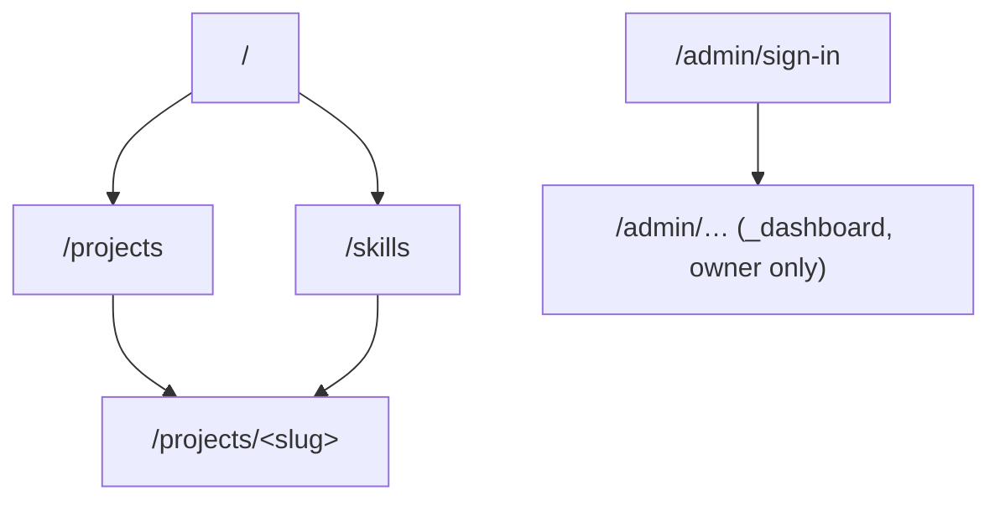
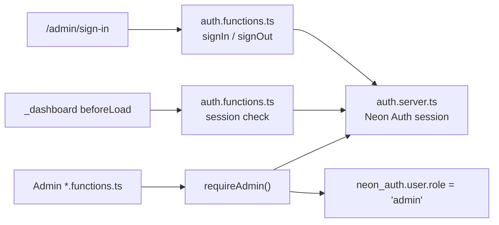
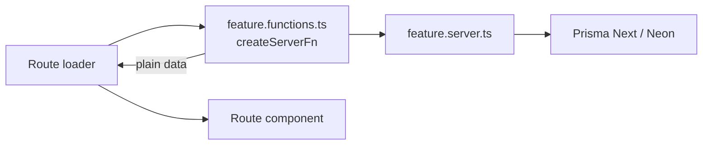

# Architecture

How the application is structured and how new code should fit in. The stack is recorded in [decision 0006](decisions/0006-tanstack-start-application-stack.md) and the folder layout in [decision 0009](decisions/0009-feature-folder-structure.md).

## Stack and entry points

A TypeScript React app on TanStack Start, running on Node.js in production ([decision 0005](decisions/0005-vercel-deployment.md)): TanStack Router for file-based routes, TanStack Query for client data, the React compiler, Tailwind CSS, and Nitro for server output. All of it is configured in [../vite.config.ts](../vite.config.ts).

| File | Owns |
| --- | --- |
| [../src/router.tsx](../src/router.tsx) | `getRouter()`: router plus a fresh QueryClient per request, wired for SSR |
| [../src/routes/__root.tsx](../src/routes/__root.tsx) | HTML document, metadata, stylesheets, scripts, devtools |
| `src/routes/_public/route.tsx` | Public layout: navbar, page outlet, footer, intro curtain, coming-soon redirect |
| `src/routes/_dashboard/`, `src/routes/admin/` | Admin layout and pages (`_dashboard`, guarded), and the sign-in page (`admin/`, unguarded) |
| [../src/routeTree.gen.ts](../src/routeTree.gen.ts) | Generated from the route files; never edit by hand |

## Planned routes

Route groups that start with `_` (`_public`, `_dashboard`) are pathless layouts and do not appear in URLs.

| URL | Route file | Purpose |
| --- | --- | --- |
| `/` | `_public/index.tsx` | Hero, description, 3 featured projects, 3 top skill categories, contact links, resume download |
| `/projects` | `_public/projects/index.tsx` | All published projects |
| `/projects/<slug>` | `_public/projects/$slug.tsx` | Case study for one project |
| `/skills` | `_public/skills.tsx` | Skill categories and skills, each linked to the projects that use them |
| `/coming-soon` | `coming-soon.tsx` | Holding page while the site is gated; `noindex` |
| `/admin/sign-in` | `admin/sign-in.tsx` | Owner sign-in; outside the guarded layout, `noindex` |
| `/admin`, `/admin/…` | `_dashboard/admin/…` | Dashboard home and the create/edit screens for each content type; owner only, `noindex` |



## Coming-soon gate

While the site is not ready, public pages redirect to `/coming-soon`. One environment variable controls the gate, and there is no bypass for the owner:

| `COMING_SOON` | Result |
| --- | --- |
| not `"true"` | Site is public; `/coming-soon` redirects to `/` |
| `"true"` | Public pages redirect to `/coming-soon` |

```ts
// src/features/site/site.utils.ts
export function isSiteGated(comingSoon: string | undefined) {
	return comingSoon === "true";
}
```

The gate is not authentication. Admin pages use Neon Auth ([intent](intent.md#answered-questions)), described below. The `_dashboard` layout is outside the gate, so the owner can sign in while the public site is gated.

## Admin authentication

Recorded in [decision 0013](decisions/0013-admin-authentication-and-authorization.md). The owner signs in with email and password; there is no sign-up. The app's own server functions talk to Neon Auth (Better Auth), so the browser never calls it and no `/api/auth/*` proxy is mounted. The session is a cookie.



| Layer | Rule |
| --- | --- |
| Security boundary | Every admin server function calls `requireAdmin()` first. It throws 401 without a session and 403 for a signed-in user whose `role` is not `admin`. The role is read from the database on each call. |
| Route guard | `_dashboard`'s `beforeLoad` redirects signed-out users to `/admin/sign-in` and shows a 403 page to non-admins. It is a UX layer and never replaces `requireAdmin()`. |
| Sign-in route | Lives outside `_dashboard`, so the redirect cannot loop. It follows a `redirect` search param only for paths that start with `/admin`. |
| Code | `src/features/auth/` per [0009](decisions/0009-feature-folder-structure.md); admin content features import `requireAdmin` from its `.server.ts`. |

```ts
// <feature>.functions.ts (intended shape)
export const deleteProject = createServerFn({ method: "POST" })
  .inputValidator(deleteProjectSchema)
  .handler(async ({ data }) => {
    await requireAdmin(); // always the first line
    return deleteProjectById(data.id);
  });
```

## Data flow

Pages load data through route loaders that call server functions. Server functions call server-only modules, which own all database access.



- A server function returns plain, serializable data. Components render it during SSR and hydrate on the client. React Server Components are not used for now ([decision 0011](decisions/0011-no-react-server-components.md)).
- Load independent sections in parallel (`Promise.all` in the loader).
- UI never imports `*.server.ts` directly; TanStack Start blocks it from the client bundle.

## Folder ownership

| Location | Responsibility |
| --- | --- |
| `src/routes/` | URLs, loaders, page composition |
| `src/features/<feature>/` | Feature code: `.server.ts`, `.functions.ts`, `utils`, `types`, `components/` ([0009](decisions/0009-feature-folder-structure.md)) |
| `src/components/`, `src/components/ui/` | Shared components and shadcn primitives |
| `src/lib/` | Shared utilities |
| `src/integrations/` | Prisma runtime and contract, TanStack Query wiring, GSAP setup (`animations/`) |
| `src/styles.css`, `src/styles/` | Global styles and tokens ([ui](ui.md)) |
| `migrations/` | Prisma Next migrations ([data](data.md)) |
| `vercel.json` | Vercel settings ([0005](decisions/0005-vercel-deployment.md)) |

Expected features: `public` (landing page), `projects`, `skills`, `site` (gate), `auth` (admin sign-in and `requireAdmin()`), and an admin feature for the dashboard.
