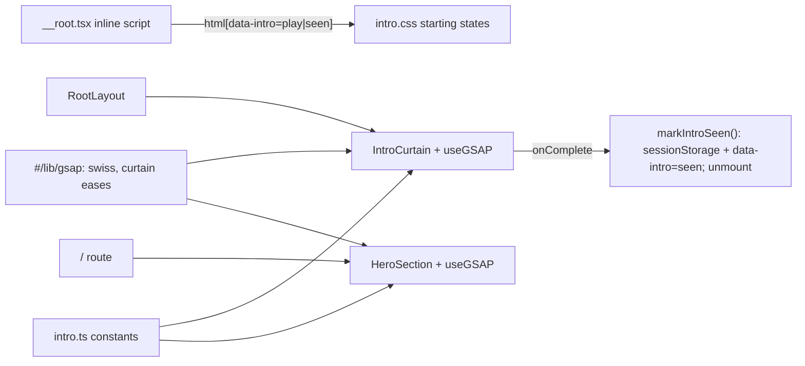

# Plan: Homepage intro animation

Change ID: 003-intro-animation
Status: Draft
Spec: [spec.md](spec.md)
Verification: [verification.md](verification.md)

## Files involved

| File | Action | Purpose |
| --- | --- | --- |
| `src/lib/gsap.ts` | Edit | Add the `curtain` CustomEase |
| `src/features/public/intro.ts` | Create | Storage key, timing constants, inline head script, `markIntroSeen()` |
| `src/routes/__root.tsx` | Edit | Inline head script; `suppressHydrationWarning` on `<html>` |
| `src/styles/intro.css` | Create | Pre-hydration starting states, scroll lock, stable scrollbar gutter and the fail-safe |
| `src/styles.css` | Edit | `@import "./styles/intro.css";` after `portfolio.css` |
| `src/features/public/components/IntroCurtain.tsx` | Create | Curtain markup and its GSAP timeline |
| `src/features/public/components/RootLayout.tsx` | Edit | Mount `<IntroCurtain />`; wrap the navbar, outlet and footer in an `inert`-able wrapper |
| `src/features/public/components/landing/HeroSection.tsx` | Edit | Real hero and its GSAP timeline |
| `src/features/public/intro.functions.tsx` | Delete | No longer used (Q4) |
| `docs/ui.md`, `docs/status.md` | Edit | HeroSection row, intro and motion notes |



## Implementation sequence

1. **Eases.** In `src/lib/gsap.ts`, next to `swiss`:

   ```ts
   CustomEase.create("swiss", "0.2,0,0,1");
   // Curtain lift from the intro canvas (option A)
   CustomEase.create("curtain", "0.76,0,0.24,1");
   ```

2. **Shared intro module.** Create `src/features/public/intro.ts`:

   ```ts
   export const INTRO_KEY = "intro-seen";
   export const INTRO_LIFT_AT = 1.55; // s, curtain starts lifting
   export const INTRO_HERO_DELAY = 1.7; // s, hero waits while the curtain lifts
   // gsap.matchMedia() only runs a callback when one of its conditions matches.
   export const FULL_MOTION = "(prefers-reduced-motion: no-preference)";
   export const REDUCED_MOTION = "(prefers-reduced-motion: reduce)";

   // Inline in <head>: runs before first paint, so it must stay dependency-free.
   export const introHeadScript = `(function(){var s="play";try{if(sessionStorage.getItem("${INTRO_KEY}"))s="seen"}catch(e){}document.documentElement.dataset.intro=s})()`;

   export function introPlaying() {
   	return document.documentElement.dataset.intro === "play";
   }

   export function markIntroSeen() {
   	document.documentElement.dataset.intro = "seen";
   	try {
   		sessionStorage.setItem(INTRO_KEY, "1");
   	} catch {}
   }
   ```

3. **Root document.**

   ```tsx
   <html lang="en" suppressHydrationWarning>
   	<head>
   		{/* biome-ignore lint/security/noDangerouslySetInnerHtml: static string; picks the intro state before first paint */}
   		<script dangerouslySetInnerHTML={{ __html: introHeadScript }} />
   		<HeadContent />
   	</head>
   ```

4. **Starting states.** Create `src/styles/intro.css`, which only describes the first paint:

   ```css
   /* No data-intro (JS off): no curtain, hero in its final state. */
   .intro-curtain { display: none; background: color-mix(in srgb, var(--paper), var(--ink-black) 10%); }
   .intro-mark { color: var(--on-accent); }

   :root[data-intro="play"] { overflow: hidden; }  /* scroll lock: no scrolling, no scrollbar */
   html { scrollbar-gutter: stable; }                /* no layout jump when a classic scrollbar returns */

   :root[data-intro="play"] .intro-curtain { display: flex; }
   :root[data-intro] .intro-hero [data-reveal] { visibility: hidden; }
   :root[data-intro] .intro-mark { color: var(--text); }
   :root[data-intro] .intro-mark-ink { transform: scaleX(0); }

   /* Fail-safe if the app bundle never runs; GSAP sets animation: none on start. */
   @keyframes intro-failsafe-hide { to { visibility: hidden; } }
   @keyframes intro-failsafe-show { to { visibility: visible; } }
   :root[data-intro="play"] .intro-curtain { animation: intro-failsafe-hide 0s 10s forwards; }
   :root[data-intro] .intro-hero [data-reveal] { animation: intro-failsafe-show 0s 10s forwards; }
   ```

5. **Layout.** Mount the curtain and make everything behind it `inert` while it plays. The server renders `inert` off, so the page stays usable without JavaScript:

   ```tsx
   export default function RootLayout() {
   	const [introActive, setIntroActive] = useState(false);

   	return (
   		<div className="flex-col w-full min-h-screen">
   			<IntroCurtain onActiveChange={setIntroActive} />
   			<div inert={introActive} className="contents">
   				<Navbar />
   				<Outlet />
   				<Footer />
   			</div>
   		</div>
   	);
   }
   ```

   `display: contents` keeps the wrapper out of the layout; `inert` still applies to its descendants.

6. **Curtain.** It reports when it starts and stops playing:

   ```tsx
   export default function IntroCurtain({ onActiveChange }: { onActiveChange: (active: boolean) => void }) {
   	const root = useRef<HTMLDivElement>(null);
   	const count = useRef<HTMLSpanElement>(null);
   	const [done, setDone] = useState(false);

   	useGSAP(
   		() => {
   			if (!introPlaying()) return setDone(true);
   			const el = root.current;
   			if (!el) return;
   			onActiveChange(true);
   			el.style.animation = "none"; // cancel the CSS fail-safe
   			const counter = { n: 0 };

   			gsap.matchMedia().add({ motion: FULL_MOTION, reduce: REDUCED_MOTION }, ({ conditions }) => {
   				gsap
   					.timeline({ onComplete: () => { markIntroSeen(); onActiveChange(false); setDone(true); } })
   					.from(".intro-curtain-label", { autoAlpha: 0, duration: 0.3, ease: "none" }, 0)
   					.to(counter, {
   						n: 100,
   						duration: 1.4,
   						ease: "power3.inOut",
   						onUpdate: () => {
   							if (count.current) count.current.textContent = String(Math.round(counter.n)).padStart(3, "0");
   						},
   					}, 0)
   					.from(".intro-progress", { scaleX: 0, transformOrigin: "left", duration: 1.4, ease: "power3.inOut" }, 0)
   					.to(el, conditions?.reduce
   						? { autoAlpha: 0, duration: 0.8, ease: "none" }
   						: { yPercent: -100, duration: 0.8, ease: "curtain" }, INTRO_LIFT_AT);
   			});
   			return () => onActiveChange(false); // never leave the page inert after an unmount
   		},
   		{ scope: root },
   	);

   	if (done) return null;
   	return (
   		<div ref={root} aria-hidden="true"
   			className="intro-curtain fixed inset-0 z-50 flex-col justify-between border-b border-rule px-4 py-6 text-foreground md:px-12 md:py-12">
   			<p className="intro-curtain-label type-label leading-11">Rence — portfolio</p>
   			<div className="flex flex-col gap-4">
   				<div className="flex items-baseline gap-3 font-label tabular-nums">
   					<span ref={count} className="intro-counter">000</span>
   					<span className="type-index">/ 100</span>
   				</div>
   				<div className="h-px bg-rule/15"><div className="intro-progress h-px bg-rule" /></div>
   			</div>
   		</div>
   	);
   }
   ```

   `.intro-counter` keeps its canvas size in `intro.css`: `font-size: clamp(4.5rem, 12vw, 10rem); line-height: 0.9; font-weight: 500`. `flex` comes from the `data-intro="play"` rule, so the class list holds `flex-col` only.

7. **Hero.** Replace the placeholder. Each animated part carries `data-reveal`, and GSAP reveals it with `autoAlpha`:

   ```tsx
   export default function HeroSection() {
   	const root = useRef<HTMLElement>(null);

   	useGSAP(
   		() => {
   			const delay = introPlaying() ? INTRO_HERO_DELAY : 0;
   			const paper = getComputedStyle(document.documentElement).getPropertyValue("--paper").trim();
   			gsap.set("[data-reveal]", { autoAlpha: 1, animation: "none" });

   			gsap.matchMedia().add({ motion: FULL_MOTION, reduce: REDUCED_MOTION }, ({ conditions }) => {
   				const reduce = conditions?.reduce;
   				const move = (from: gsap.TweenVars) => (reduce ? { autoAlpha: 0 } : from);
   				gsap
   					.timeline({ delay, defaults: { ease: "swiss" } })
   					.from(".intro-char", { ...move({ yPercent: 105 }), duration: 0.8, stagger: 0.05 }, 0.1)
   					.from(".intro-eyebrow", { autoAlpha: 0, ...move({ y: 12 }), duration: 0.5 }, 0.2)
   					.from(".intro-lead", { autoAlpha: 0, ...move({ y: 12 }), duration: 0.5 }, 0.6)
   					.from(".intro-rule", { ...move({ scaleX: 0 }), transformOrigin: "left", duration: 0.7 }, 0.75)
   					.from(".intro-meta", { autoAlpha: 0, ...move({ y: 12 }), duration: 0.5 }, 1.0)
   					.to(".intro-mark-ink", reduce ? { scaleX: 1, duration: 0 } : { scaleX: 1, transformOrigin: "left", duration: 0.3 }, 1.05)
   					.to(".intro-mark", { color: paper, duration: 0.3 }, 1.05);
   			});
   		},
   		{ scope: root },
   	);

   	return (
   		<section ref={root}
   			className="intro-hero mx-auto flex min-h-svh w-full max-w-grid flex-col justify-end overflow-hidden px-4 py-6 md:px-12 md:py-12">
   			<p data-reveal className="intro-eyebrow type-label mb-8">Full-stack developer</p>
   			<h1 aria-label="Rence" className="text-display-xl">
   				<span data-reveal aria-hidden="true" className="inline-block overflow-hidden pb-[0.04em] align-bottom">
   					{[..."Rence"].map((char, i) => (
   						<span key={i} className="intro-char inline-block">{char}</span>
   					))}
   				</span>
   			</h1>
   			<p data-reveal className="intro-lead mt-8 max-w-xl text-lead">
   				I build{" "}
   				<span className="intro-mark relative isolate px-[0.12em] font-medium">
   					<span aria-hidden="true" className="intro-mark-ink absolute inset-0 -z-10 origin-left bg-ink" />
   					full-stack web apps
   				</span>{" "}
   				with Next.js, Supabase and TypeScript.
   			</p>
   			<div data-reveal className="intro-rule mt-12 h-0.5 bg-rule" />
   			<div data-reveal className="intro-meta type-label mt-4 flex justify-between gap-4 text-muted-foreground">
   				<span>Portfolio</span><span>2026</span>
   			</div>
   		</section>
   	);
   }
   ```

   `from()` tweens render their start state immediately, inside the layout effect, so a delayed timeline still never paints the final state first.

8. **Unused server functions.** Delete `src/features/public/intro.functions.tsx`; confirm with `grep -r intro.functions src` that nothing imports it.
9. **Docs.** Update the `HeroSection` row and add an intro and motion note in `docs/ui.md` (GSAP via `#/lib/gsap`, `swiss` and `curtain` eases); note the intro in `docs/status.md`.
10. **Verify.** Run the checks below and record them in `verification.md`.

## Verification mapping

| Criterion | Check or inspection |
| --- | --- |
| AC-01 | Fresh tab at `/` and `/projects` with the browser pane visible: watch the curtain; sample the counter text and `gsap.getProperty(curtain, "yPercent")` during playback, or step `gsap.globalTimeline` with `progress()` if the pane is hidden |
| AC-02 | After completion: `sessionStorage.getItem("intro-seen") === "1"`, `document.documentElement.dataset.intro === "seen"`, no `.intro-curtain` in the DOM |
| AC-03 | Reload: server HTML plus head script give `data-intro="seen"` before hydration; no `.intro-curtain` is ever displayed; hero timeline `delay()` is 0; navigate `/` → `/skills` → `/`: no curtain |
| AC-04 | Close the tab, open `/` in a new tab: curtain plays |
| AC-05 | Accessibility tree shows `heading "Rence"` level 1; computed styles match the design-system utilities |
| AC-06 | Load `/` with JavaScript disabled (or the raw server HTML without the head script): hero visible, curtain `display: none` |
| AC-07 | Run with reduced motion emulated if the tools allow; otherwise review the `matchMedia` branch: no `y`, `yPercent` or `scaleX` tweens in the reduce path except the instant ink fill |
| AC-08 | `aria-hidden` on the curtain; at 375×812, `document.documentElement.scrollWidth <= 375`; console has no hydration warning |
| AC-10 | During playback: `getComputedStyle(document.documentElement).overflow === "hidden"`, `scrollY` stays 0 after a wheel scroll, the content wrapper `hasAttribute("inert")`, Tab doesn't reach navbar links; after completion all three are reversed |
| AC-11 | The file is gone; `grep -r intro.functions src` finds nothing; typecheck passes |
| AC-09 | `bun --bun run verify` compared with the recorded baseline |

## Risks and recovery

- **Starts at hydration.** A slow bundle holds the curtain at `000`. That's acceptable for a preloader, and the 10 s fail-safe covers a bundle that never runs.
- **React Strict Mode or remounts.** `useGSAP` reverts its context on unmount, so a remount replays from the start, not half-way. `markIntroSeen` runs only from `onComplete`.
- **Build rewrites migration snapshots.** `vite build` regenerates `migrations/snapshots/*/contract.*`. Restore them with `git checkout -- migrations/snapshots` after verifying, unless the owner wants that refresh committed separately.
- **Coming-soon gate in dev.** Local preview needs a `preview` cookie in the preview browser only. No `.env` change.
- **Hidden browser pane.** It pauses `requestAnimationFrame`, and so the GSAP ticker. Watch live with the pane visible, or step timelines from JavaScript.
- **Recovery.** Every change is confined to the files above. To roll back, revert those files and delete the new ones.

## Acceptance record

Pending. Owner direction so far (2026-10-04): implement option A; plan first; the curtain replays when the tab is closed and reopened; the owner edits the hero wording; use GSAP; scroll lock and `inert` instead of a portal; delete `intro.functions.tsx`.

## Deviations

- 2026-10-04: the plan's `gsap.matchMedia().add({ reduce: REDUCED_MOTION }, …)` never ran with reduced motion off, because `matchMedia` only calls back when a condition matches. Both timelines now pass `{ motion: FULL_MOTION, reduce: REDUCED_MOTION }`.
- 2026-10-04, owner request: `/coming-soon` also mounts `IntroCurtain`, with its content in an `inert` wrapper like `RootLayout`. It shares the per-tab `intro-seen` flag. `ComingSoonComponent` switched from `w-screen` to `w-full`, so the stable scrollbar gutter can't cause horizontal overflow.
- The curtain and intro helpers live in `src/features/public/components/intro/IntroCurtain.tsx` and `src/features/public/lib/intro.ts` (the owner's layout), not the paths listed above.
