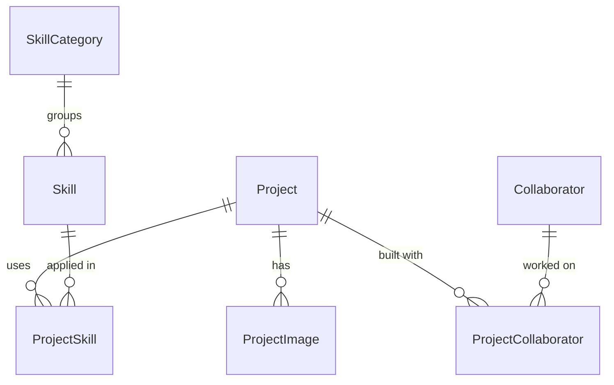

# Data and server access

Source snapshot: **2026-10-04**. The schema was applied to Neon and checked with `prisma db verify` that day. No content rows exist yet.

## Active database path

The database is **Neon Postgres**: project `portfolio`, branch `production`, database `neondb`, reached through `DATABASE_URL`. The same database holds Neon Auth (Better Auth) in the `neon_auth` schema. The app's tables live in `public`. See [decision 0003](decisions/0003-neon-database-and-portfolio-schema.md) for why.

The runtime uses **Prisma Next** through `@prisma/orm-postgres`, not traditional Prisma Client. `@prisma/client` and `@prisma/adapter-pg` are installed but unused.

| File | Role |
| --- | --- |
| [Contract source](../src/integrations/prisma/contract.ts) | Model, enum, and relation definitions (TypeScript builder) |
| [Contract JSON](../src/integrations/prisma/contract.json) | Generated runtime contract |
| [Contract types](../src/integrations/prisma/contract.d.ts) | Generated query types |
| [Database runtime](../src/integrations/prisma/db.ts) | Loads dotenv and creates the PostgreSQL runtime using `DATABASE_URL` |
| [Prisma config](../prisma.config.ts) | Contract path and database connection |
| [Prisma Next guide](../prisma-next.md) | Tool-specific reference |

No `schema.prisma` exists. Traditional Prisma schema and migration workflows do not apply.

## Models



| Model | Fields | Notes |
| --- | --- | --- |
| `Project` | `id`, `slug`, `title`, `description`, `coverImageKey?`, `githubUrl?`, `liveUrl?`, `status`, `featuredRank?`, `published`, `teamName?`, `metadata`, `startedAt?`, `endedAt?`, `createdAt`, `updatedAt` | `slug` and `featuredRank` are unique. `status` is `ONGOING` or `COMPLETED` (default `ONGOING`). `published` defaults to `false`. `metadata` is `jsonb`, default `{}`. Dates are `YYYY-MM-DD` strings. |
| `ProjectImage` | `id`, `projectId`, `key`, `alt`, `order` | Cascades when its project is deleted |
| `SkillCategory` | `id`, `slug`, `name`, `overview`, `confidence?`, `topRank?`, `createdAt`, `updatedAt` | `slug` and `topRank` are unique. `confidence` is 0–100, enforced by the admin form, not the database. |
| `Skill` | `id`, `categoryId`, `slug`, `name`, `createdAt` | `slug` is unique. Deleting a category that has skills is restricted. |
| `ProjectSkill` | `projectId`, `skillId` | Composite primary key. Cascades from both sides. |
| `Collaborator` | `id`, `name`, `profileUrl?` | People you built projects with. They do not sign in. |
| `ProjectCollaborator` | `projectId`, `collaboratorId`, `role?` | Composite primary key. Cascades from both sides. |

IDs are native `uuid`. Prisma Next generates UUIDv7 values on insert, and the database has no default, so raw SQL inserts must supply `id`. Image fields store storage bucket keys, not URLs.

Rank fields set manual order: null means "not shown", and the unique integer is the position. The homepage reads `Project.featuredRank` and `SkillCategory.topRank`.

## Queries

[../src/features/projects/projects.server.ts](../src/features/projects/projects.server.ts):

- `getFeaturedProjects({ limit = 3 })` returns published projects with a `featuredRank`, ordered by rank ascending.
- `getProjects({ take, skip })` returns published projects, newest `createdAt` first.
- `getProjectBySlug(slug)` returns the published project with that slug. No route calls it yet.

[../src/features/skills/skills.server.ts](../src/features/skills/skills.server.ts):

- `getTopSkills({ limit = 3 })` returns skill categories with a `topRank`, ordered by rank ascending.

The homepage requests three featured projects and three top skill categories through [public server functions](../src/features/public/public.functions.tsx).

The many-to-many relations (`Project.skills`, `Skill.projects`) are declared with `rel.manyToMany` through `ProjectSkill`. The installed Prisma Next version does not support `.include()` across a junction table. Query the join through `db.sql` with an explicit join instead.

## Schema changes

```bash
# 1. Edit src/integrations/prisma/contract.ts, then:
bun --bun prisma contract emit
# 2. Plan a migration; it chains from migrations/app/refs/db.json
bun --bun prisma migration plan --name <snake_slug>
# 3. Preview, then apply (applying changes the database: ask first)
bun --bun prisma db migrate --show --from @db
bun --bun prisma db migrate --advance-ref db
```

`bun --bun prisma db verify` checks that the database marker and schema match the contract.

## Migration history

- `migrations/app/20261004T0803_portfolio_schema` is the baseline. It creates every table from empty, ending at contract hash `74a37888…`. `refs/db.json` points at that hash.
- The superseded `20260829T1353_init` migration and its `db` ref were moved out of the graph so the baseline could plan from empty, then deleted on 2026-10-05.
- `migrations/snapshots/` still contains snapshots of the old contracts. They are content-addressed and harmless.

## Seed

No seed exists. The `db:seed`, `db:push`, `db:migrate`, `db:generate`, and `db:studio` scripts in `package.json` use traditional Prisma command names and are not verified with Prisma Next. Enter content through the planned admin page, or add a Prisma Next seed script.

Never include real `DATABASE_URL` values in documentation or logs shared with others.
