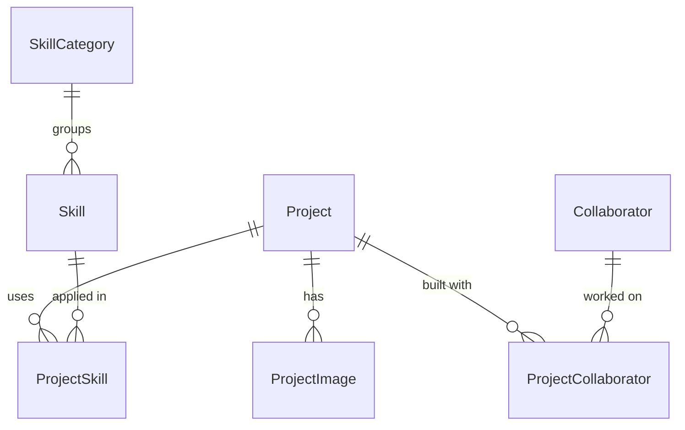

# Data

How data is stored and accessed. The database choice and schema rationale are in [decision 0003](decisions/0003-neon-database-and-portfolio-schema.md).

## Database

**Neon Postgres**: project `portfolio`, branch `production`, database `neondb`, reached through `DATABASE_URL`. App tables live in `public`; Neon Auth (Better Auth) lives in `neon_auth`.

The data layer is **Prisma Next** (`@prisma/orm-postgres`), not traditional Prisma Client. Use the `prisma-8` skill. Do not use `@prisma/client`, `@prisma/adapter-pg`, a `schema.prisma`, or the `db:*` scripts in `package.json`; they belong to traditional Prisma.

| File | Role |
| --- | --- |
| [Contract source](../src/integrations/prisma/contract.ts) | Models, enums, relations (TypeScript builder); edit this |
| [Contract JSON](../src/integrations/prisma/contract.json), [types](../src/integrations/prisma/contract.d.ts) | Generated by `contract emit`; never edit |
| [Database runtime](../src/integrations/prisma/db.ts) | Creates the runtime from `DATABASE_URL` |
| [Prisma config](../prisma.config.ts) | Contract path and connection |
| [Prisma Next guide](../prisma-next.md) | Tool reference |

## Models



| Model | Fields | Rules |
| --- | --- | --- |
| `Project` | `id`, `slug`, `title`, `description`, `coverImageKey?`, `githubUrl?`, `liveUrl?`, `status`, `featuredRank?`, `published`, `teamName?`, `metadata`, `startedAt?`, `endedAt?`, `createdAt`, `updatedAt` | `slug` and `featuredRank` unique. `status` is `ONGOING` or `COMPLETED`. `published` defaults to `false`. `metadata` is `jsonb` for keys that have not earned a column. Dates are `YYYY-MM-DD` strings. |
| `ProjectImage` | `id`, `projectId`, `key`, `alt`, `order` | Cascades with its project. `alt` is required. |
| `SkillCategory` | `id`, `slug`, `name`, `overview`, `confidence?`, `topRank?`, `createdAt`, `updatedAt` | `slug` and `topRank` unique. `confidence` is 0–100, enforced by the admin form. |
| `Skill` | `id`, `categoryId`, `slug`, `name`, `createdAt` | `slug` unique. A category with skills cannot be deleted. |
| `ProjectSkill` | `projectId`, `skillId` | Composite key; cascades from both sides |
| `Collaborator` | `id`, `name`, `profileUrl?` | People credited on projects; they do not sign in |
| `ProjectCollaborator` | `projectId`, `collaboratorId`, `role?` | Composite key; cascades from both sides |

- IDs are native `uuid`. Prisma Next generates UUIDv7 on insert; the database has no default, so raw SQL inserts must supply `id`.
- Image fields store storage bucket keys, not URLs. Resolve keys on the server before returning image URLs to the UI; see [image storage](#image-storage).
- Rank fields set manual order: `null` means not shown, and the integer is the position. The homepage uses `Project.featuredRank` and `SkillCategory.topRank`.

## Image storage

Use Files SDK with the `files-sdk/neon` adapter for Neon Object Storage ([decision 0005](decisions/0005-vercel-deployment.md#object-storage-client)). Keep client configuration and storage operations in `src/features/storage/storage.server.ts`; feature server modules call it and return plain data through server functions.

- `Project.coverImageKey` and `ProjectImage.key` remain object keys. Do not persist public or presigned URLs in these fields.
- For a `public_read` bucket, set the adapter's `publicBaseUrl` to the branch endpoint plus bucket path, or to a CDN base URL. `url(key)` then returns a stable public URL. Only place objects intended for anonymous access in such a bucket.
- Without `publicBaseUrl`, `url(key)` generates an expiring presigned GET URL. Set an explicit lifetime and ensure cached page data does not retain expired URLs. Generating a URL does not confirm that the object exists.
- Return no image URL for an absent key, and let the UI render a placeholder. Check nested paths and special characters when testing URL resolution.
- Storage endpoint, bucket, and credentials must correspond to the branch used by the database connection. Configure them separately for local development and each Vercel environment; keep credentials server-only and out of `VITE_` variables.

See the [Neon adapter reference](https://files-sdk.dev/docs/adapters/neon) for configuration and required AWS SDK peers. Upload transport, file limits, key naming, and cleanup policy are tracked separately in Linear WD-27.

## Query rules

- Queries live in `<feature>.server.ts` and are exposed through `<feature>.functions.ts` ([0009](decisions/0009-feature-folder-structure.md)).
- Public queries filter on `published = true`.
- Project pages look up by `slug`.
- Prisma Next cannot `.include()` across the `ProjectSkill` junction. Query project↔skill lists with `db.sql` and an explicit join.

## Content

Content is entered through the admin page ([intent](intent.md#site-structure)). A Prisma Next seed script is optional for local data. The resume is a static `public/resume.pdf`, not a table.

## Schema changes

Applying a migration changes the database: ask the owner first.

```bash
# 1. Edit src/integrations/prisma/contract.ts, then:
bun --bun prisma contract emit
# 2. Plan a migration; it chains from migrations/app/refs/db.json
bun --bun prisma migration plan --name <snake_slug>
# 3. Preview, then apply
bun --bun prisma db migrate --show --from @db
bun --bun prisma db migrate --advance-ref db
# 4. Confirm the database matches the contract
bun --bun prisma db verify
```

Treat migration packages, snapshots, and refs as tool-managed; do not rewrite history. Never put a real `DATABASE_URL` in docs or shared logs.
