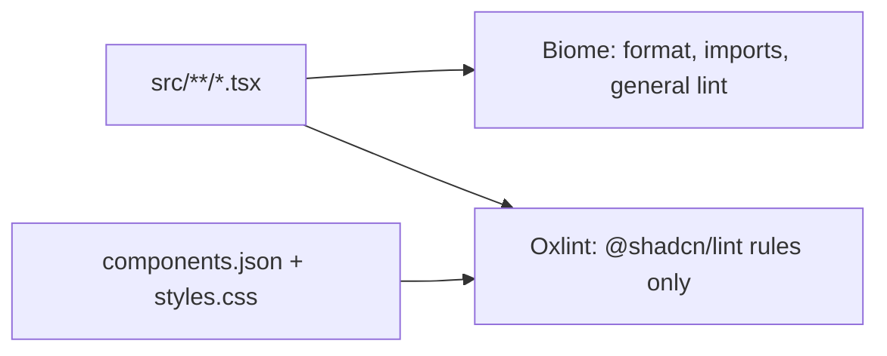

# 0001: Oxlint for design-system lint alongside Biome

Date: 2026-09-30
Status: Accepted

## Context

The project wanted `@shadcn/lint`, a linter that checks Tailwind class usage against the project's components, variants, and theme tokens. It runs only as an ESLint or Oxlint plugin. The project already used Biome for formatting and general linting, and Biome cannot load it.

## Decision

Add Oxlint as a second linter whose only job is design-system rules.

- `@shadcn/lint` and `oxlint` are dev dependencies.
- [../../.oxlintrc.json](../../.oxlintrc.json) registers the plugin through `jsPlugins`, turns off Oxlint's default `correctness` category, and ignores `src/routeTree.gen.ts`.
- `bun --bun run lint:ds` runs it. The Biome `lint`, `format`, and `check` scripts are unchanged.
- No `shadcn/*` rules are enabled. Choosing them is a separate decision.

## Alternatives

- **ESLint instead of Oxlint.** Also supported, but needs a parser setup and is slower. The `@shadcn/lint` setup guide recommends Oxlint for React projects that have neither linter.
- **Replace Biome with Oxlint.** Larger change with no benefit for the goal; Biome also formats.
- **Leave Oxlint's default rules on.** They duplicated Biome's findings (unused variables, empty files), so the same issue would be reported twice.

## Consequences

- Two lint commands. Agents and CI need to run both `check` and `lint:ds`.
- `lint:ds` passes trivially until rules are enabled.
- Autofixes from `@shadcn/lint` can rewrite class strings that Biome then reformats; the two do not conflict.

## Validation

On 2026-09-30, `lint:ds` loaded the plugin and exited 0. A trial run with `no-arbitrary-values`, `no-raw-colors`, `no-restyle`, and `no-unknown-classes` set to warn (not saved) read `components.json` and reported two arbitrary values in `src/components/ui/button.tsx`. Behavior with rules permanently enabled is unverified.
