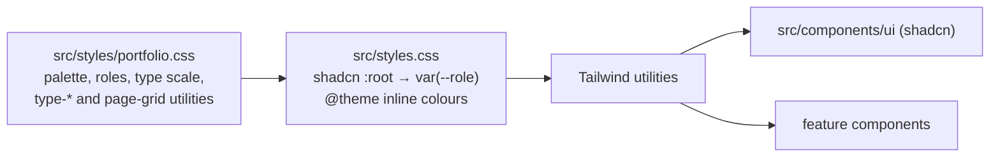

# 0002: Portfolio design tokens under the shadcn variables

Date: 2026-10-04
Status: Accepted

## Context

The portfolio's visual direction is defined in the Rence Portfolio design system (a claude.ai design-system artifact, tokens version 1): a monochrome Swiss/typographic system with paper `#f5f4f0`, ink `#04151f`, dim-grey `#6d696a` and steel-grey `#848c92`, Outfit for reading, Geist Mono for labels and data, a 12-step type scale, a 4px spacing rhythm, and hairline rules instead of cards.

`src/styles.css` held the shadcn `base-mira` taupe tokens plus leftovers: a `#f8fff4` background, unused `--color-navy` and `--color-ocean-blue`, an Oxanium import that nothing used, and a `--font-heading` naming Instrument Sans, which was never loaded. The shadcn primitives in `src/components/ui/` depend on the shadcn variable names, and `components.json` points the shadcn CLI and `@shadcn/lint` at `src/styles.css`.

## Decision

Keep every shadcn variable name, the `.dark` block, `--secondary`, `--muted`, `--accent`, `--destructive`, `--chart-*` and the `--radius` scale at their shadcn values. Point only the light colour variables at portfolio roles, and add portfolio-only tokens beside them.

- `src/styles/portfolio.css` defines the palette (`--ink-black`, `--paper`, `--steel-grey`, `--dim-grey`), the semantic roles (`--surface`, `--text`, `--text-muted`, `--rule`, `--focus`…), the `--text-*` type scale, `--font-label`, `--ease-swiss`, `--container-grid`, and the `type-label`, `type-meta`, `type-index` and `page-grid` utilities.
- `src/styles.css` imports it and remaps the shadcn values, for example `--background: var(--surface)`, `--primary: var(--surface-accent)`, `--border: var(--rule-soft)`, `--ring: var(--focus)`. Its `@theme inline` block adds colour utilities such as `bg-ink`, `border-rule`, `bg-inverse` and `text-inverse-muted`.
- `src/lib/utils.ts` extends `tailwind-merge` with the custom font sizes so `cn()` does not treat `text-display-l` as a colour.
- Outfit and Geist Mono come from `@fontsource-variable/*`. Oxanium was removed.

## Alternatives

- **Purely additive:** leave every shadcn value alone and add portfolio tokens only. Rejected: shadcn components would keep the taupe palette and clash with the portfolio pages.
- **Full re-skin with `--radius: 0`:** matches the system's square-corner rule. Not chosen for now, so the shadcn components keep their default rounded geometry.
- **Copying hex values into the shadcn variables:** rejected in favour of `var(--role)` references, so a palette change happens in one place.

## Consequences

- shadcn primitives render with the portfolio colours (ink primary, paper surfaces, steel-grey borders and inputs) without changing their source.
- shadcn primitives stay rounded, which departs from the system's `radius-none` rule. Portfolio components should use `rounded-none` or rely on square defaults.
- `.dark` keeps shadcn's dark palette; the design system defines no dark theme.
- `shadcn add` or `shadcn apply` may write literal `oklch()` values back into `:root`. Diff `src/styles.css` after any CLI run and restore the `var(--role)` lines.
- `src/styles/**` is excluded from Biome, as `src/styles.css` already was, because Biome's CSS parser has Tailwind directives disabled.
- Tailwind's default spacing (`--spacing: 0.25rem`), border widths, the `md` breakpoint (768px) and the default durations already match the system, so no tokens were added for them.

## Validation

On 2026-10-04: `bun --bun run build` passed, `bun --bun run lint:ds` passed, `bunx tsc --noEmit` showed only the existing `TS6198` in `ProjectCard.tsx`, and Biome reported no findings in the touched files. In the running dev server, `body` computed to paper `rgb(245, 244, 240)` and ink `rgb(4, 21, 31)` in Outfit Variable, both variable fonts loaded, and `bg-primary` resolved to ink with paper text. A Tailwind CLI compile of `src/styles.css` with a probe file emitted the expected `text-display-*`, `type-*`, `page-grid`, `bg-ink`, `border-rule`, `max-w-grid` and `ease-swiss` rules, and `cn("text-display-l", "text-muted-foreground")` kept both classes.

Not verified: rendered pages using the new utilities (none use them yet), responsive behaviour on real pages, and whether `@shadcn/lint` rules such as `no-unknown-classes` see tokens defined in the imported `portfolio.css`.
