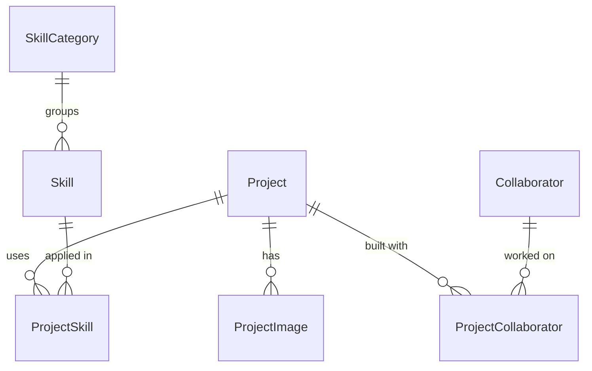

# 0003: Neon as the database host and the portfolio schema

Date: 2026-10-04
Status: Accepted

## Context

The scaffold selected both the `prisma` and `neon` add-ons. The `post-cta-init` script ran `create-db`, which wrote a temporary Prisma Postgres connection string to `.env`. Because `DATABASE_URL` was already set, `vite-plugin-neon-new` never provisioned anything. The app therefore ran against a Prisma Postgres database, although the README and docs described Neon.

The data contract did not express the product intent: it had no slug, no manual featured order, and related `Project` and `Skill` through their own `id` with no join model or foreign keys. The only on-disk migration stopped at an older contract, so a fresh database could not be rebuilt from migrations.

The owner already had a Neon project, `portfolio`, with Neon Auth (Better Auth) provisioned and an older, unrelated set of tables.

## Decision

Use the Neon project `portfolio` (`tiny-meadow-95068226`), branch `production`, database `neondb`, through `DATABASE_URL`. Prisma Next stays the data layer. The database runs Neon Auth in the `neon_auth` schema, and the app's tables live in `public`.

The schema is defined in [`src/integrations/prisma/contract.ts`](../../src/integrations/prisma/contract.ts) and applied by the baseline migration `migrations/app/20261004T0803_portfolio_schema` (contract hash `74a37888…`).

| Choice | Rule |
| --- | --- |
| Skills | Two levels: `SkillCategory` (an area such as Web Development) groups `Skill` (a technology such as React). Projects link to `Skill` through `ProjectSkill`. |
| Case-study URLs | `/projects/<slug>`, with `Project.slug` unique |
| Featured projects | `Project.featuredRank`: null means not featured, and a unique integer sets homepage order |
| Top skills | `SkillCategory.topRank`, the same rule as `featuredRank` |
| Confidence | `SkillCategory.confidence`, an optional 0–100 integer validated by the admin form |
| Visibility | `Project.published` defaults to `false`; public queries filter on it |
| Case-study content | `description` only for now. Problem, approach, and result fields were deferred. |
| Extras | `Project.metadata` (`jsonb`, default `{}`) holds keys that have not earned a column. It is not rendered. |
| Team | `Project.teamName`, plus `Collaborator` and `ProjectCollaborator` (with an optional `role`) |
| Images | `Project.coverImageKey` and `ProjectImage` store storage bucket keys, not URLs. `alt` is required. |
| Deletes | Deleting a project cascades to its images, skills, and collaborators. Deleting a category that has skills is restricted. |
| IDs | Native `uuid`, UUIDv7 generated by Prisma Next on insert. The database has no default. |
| Resume | A static `public/resume.pdf`, with no table |
| Admin | `neon_auth.user.role = 'admin'`, with no app table |

## Alternatives

- **Keep Prisma Postgres.** Rejected: the owner is more familiar with Neon, and the Neon project already provides Neon Auth and storage buckets.
- **A new Neon project.** Rejected in favour of reusing `portfolio`, which already has Neon Auth configured.
- **Adopt the old Neon tables** (`contract infer` + `db sign`). Rejected: they held placeholder data and did not include manual ordering. Their good ideas (slug, join table, images, categories) were carried into the new contract. The old tables and their enum types were dropped after a snapshot.
- **Chain the new migration from the old `init` migration.** Rejected: it would have required destructive type changes and hand-filled data placeholders on tables that are always empty. The old migration and `db` ref were moved to `migrations-archive/` so the planner could write a clean baseline.
- **A single `featured` boolean plus a sort field.** Rejected: one nullable rank cannot represent "featured with no position".

## Consequences

- `vite-plugin-neon-new`, `@neondatabase/serverless`, `neon-vite-plugin.ts`, `db/init.sql`, and the `post-cta-init` script were removed. A fresh clone no longer provisions a temporary database; set `DATABASE_URL` first.
- `prisma.config.ts` now points at `src/integrations/prisma/contract.ts`. It previously pointed at a missing `src/prisma/` path, which broke every CLI command.
- Public queries hide unpublished projects. `getProjectById` became `getProjectBySlug`.
- Raw SQL inserts must supply `id`, because the database has no default for it.
- `migrations-archive/` held the old `init` migration and `db` ref. It was deleted on 2026-10-05.
- Follow-up work: the admin page with Neon Auth, a storage bucket for images, and a way to turn a bucket key into a public URL.

## Validation

- `prisma db init --dry-run` connected to Neon. Later, `prisma db migrate --show --from @db` listed exactly one migration.
- The owner ran `prisma db migrate --advance-ref db`. `prisma db verify` then reported "Database marker and schema match contract", and `refs/db.json` points at `74a37888…`.
- The dev server rendered `/` with the project and skill sections after the change. Both queries returned empty lists, because no content has been entered yet.
- `bunx tsc --noEmit` reports only the existing `ProjectCard` unused-props error. Biome passes on the changed files.
- Not verified: production deployment, Neon Auth sign-in, and storage buckets.
- Snapshot `snap-rough-mud-ao9z178e` holds the database state before the old tables were dropped.
