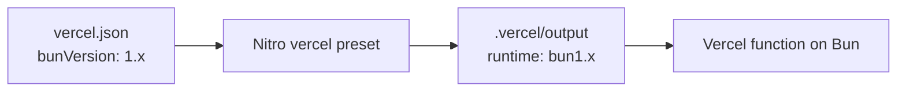

# 0005: Vercel deployment with the Bun runtime

Date: 2026-10-05
Status: Accepted

## Context

The site was already deployed on Vercel (project `final-portfolio`) through the Git integration: `main` builds production at `portfolio.wends.dev`, and other branches build login-protected previews. The repository had no Vercel configuration, so Vercel used its defaults: it detected `bun.lock` for installation and ran Nitro's server functions on Node.js. Development and the local build use Bun, so production ran on a different runtime.

## Decision

Keep Vercel and add [../../vercel.json](../../vercel.json):

```json
{
  "$schema": "https://openapi.vercel.sh/vercel.json",
  "bunVersion": "1.x",
  "installCommand": "bun install --frozen-lockfile",
  "buildCommand": "bun --bun run build"
}
```



Nitro detects Vercel and reads `bunVersion` from `vercel.json`, so `vite.config.ts` needs no preset. `--frozen-lockfile` fails the build if `bun.lock` and `package.json` disagree.

## Alternatives

- **No `vercel.json`:** works, but production runs on Node.js while development uses Bun.
- **`vercel.functions.runtime` in Nitro config:** same result, but splits Vercel settings between `vite.config.ts` and the Vercel project; `vercel.json` keeps them in one place.
- **Another host:** no reason to move; the domain and project already exist on Vercel.

## Consequences

- Production and local builds use the same runtime.
- Vercel's Bun runtime is newer than its Node.js runtime. If a dependency fails on it, remove `bunVersion` to return to Node.js.
- Environment variables (`DATABASE_URL`, `COMING_SOON`, `PREVIEW_TOKEN`) live in the Vercel project, per environment.
- Every push to `main` deploys to production.

## Validation

On 2026-10-05, `NITRO_PRESET=vercel bun --bun run build` passed, and the generated `.vc-config.json` recorded `"runtime": "bun1.x"`. Not yet verified: a Vercel deployment using this configuration, and database access from the Bun function.
