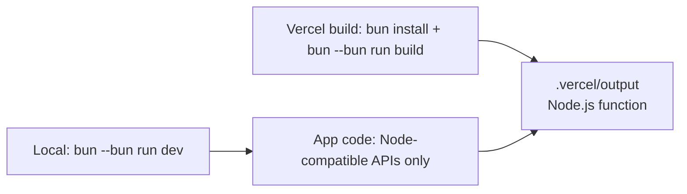

# 0005: Vercel deployment on the Node.js runtime

Date: 2026-10-05
Updated: 2026-10-06
Status: Accepted

## Context

The site deploys on Vercel (project `final-portfolio`) through the Git integration: `main` builds production at `portfolio.wends.dev`, and other branches build login-protected previews. The repository uses Bun as package manager and dev tool.

Earlier on 2026-10-05, `vercel.json` set `bunVersion: "1.x"` to run production on Vercel's Bun runtime, so the app could use Bun's built-in S3 client for Neon Object Storage. The owner then weighed Bun against Node.js and chose Node.js for production.

## Decision

Run production on Vercel's **Node.js runtime**. Keep Bun for installing, building, and local development. [../../vercel.json](../../vercel.json):

```json
{
  "$schema": "https://openapi.vercel.sh/vercel.json",
  "installCommand": "bun install --frozen-lockfile",
  "buildCommand": "bun --bun run build"
}
```

Nitro picks Vercel's Bun runtime whenever the build itself runs under Bun (`"Bun" in globalThis`), which `bun --bun run build` does. [../../vite.config.ts](../../vite.config.ts) therefore sets the runtime explicitly:

```ts
nitro({
  vercel: { functions: { runtime: "nodejs24.x" } },
});
```

This only affects the `vercel` preset; local builds still use Nitro's `bun` preset. `--frozen-lockfile` fails the build if `bun.lock` and `package.json` disagree.

Do not use Bun-only runtime APIs (`Bun.s3`, `Bun.sql`, `Bun.password`, and similar) in application code.

### Object storage client

On 2026-10-06, the owner chose **Files SDK with the `files-sdk/neon` adapter** for Neon Object Storage, following [Neon's recommendation](https://github.com/neondatabase/agent-skills/blob/main/skills/neon-object-storage/SKILL.md). The adapter uses the AWS S3 client internally and enforces Neon's path-style addressing. Use its unified upload, delete, existence-check, and URL APIs behind `src/features/storage/storage.server.ts`; routes and components receive plain data through existing server functions.

Install `files-sdk` with the adapter's peer dependencies: `@aws-sdk/client-s3`, `@aws-sdk/s3-presigned-post`, and `@aws-sdk/s3-request-presigner`. The [adapter documentation](https://files-sdk.dev/docs/adapters/neon) lists additional optional peers for multipart and progress-enabled uploads.

Store object keys in Postgres. For a `public_read` bucket, configure the adapter's `publicBaseUrl` with the bucket's public base URL (including the bucket path) or a CDN base URL. Then `url(key)` returns a stable public URL. Without `publicBaseUrl`, it returns a presigned GET URL that expires; choose its lifetime explicitly and refresh it before expiry. See [data conventions](../data.md#image-storage).

This selects the client; upload transport, size/type limits, key naming, and cleanup policy remain separate decisions tracked in Linear WD-27.



## Alternatives

**Bun runtime on Vercel (`bunVersion`) with `Bun.s3`.** Rejected for now.

| | Bun runtime | Node.js runtime (chosen) |
| --- | --- | --- |
| Status on Vercel | Public beta | Generally available |
| Storage client | Built in, no packages | Files SDK Neon adapter + AWS SDK peers |
| Neon Object Storage | Should work; checksum behavior untested | Documented by Neon |
| Production debugging | No automatic source maps | Source maps |
| Cold starts | No bytecode caching | Bytecode caching |
| Vitest ([0010](0010-vitest-tests-in-every-pr.md)) | Cannot run Bun APIs on Bun 1.3 | Runs everything natively |
| Versions | Local, CI, and Vercel must match; 1.4 is a breaking rewrite | Routine |
| Switching later | Hard once Bun APIs are in code | Easy |

Revisit when Vercel's Bun runtime is generally available and the project moves to Bun 1.4.

**Direct AWS S3 SDK calls.** Supported by Neon, but not the default application interface. Files SDK reduces command and presigner boilerplate for the portfolio's image operations. Its cost is an additional community-maintained dependency layer while retaining AWS SDK peers. Use the native client only when a required operation is not covered by the wrapper.

## Consequences

- Production runs on a mature runtime with source maps, metrics, and bytecode caching.
- Storage uses `files-sdk` plus its Neon adapter's AWS SDK peers. Keep the client and configuration behind one `storage.server.ts` module so callers do not depend on provider-specific APIs.
- Neon Function environment injection does not configure Vercel automatically. Supply the branch's storage endpoint, region, credentials, bucket name, and optional public base URL in the appropriate Vercel environment; they must match the branch used by `DATABASE_URL`.
- Development runs Vite on Bun (`--bun`) while production runs Node.js. Only Node-compatible APIs are allowed, and CI tests run on Node.js, which catches most gaps.
- Environment variables (`DATABASE_URL`, `COMING_SOON`, and later the S3 credentials) live in the Vercel project, per environment.
- Every push to `main` deploys to production.

## Validation

On 2026-10-05, a production deployment on the Bun runtime succeeded and `/coming-soon` responded. After the switch, `NITRO_PRESET=vercel bun --bun run build` wrote `"runtime": "nodejs24.x"` to `.vc-config.json`, and `verify` passed. The Node.js deployment is validated when the next production deployment succeeds and `/coming-soon` responds.
