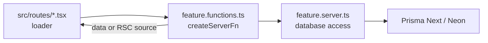

# 0006: TanStack Start as the application stack

Date: 2026-10-05
Status: Accepted

## Context

The portfolio needs server rendering, file-based routes, and server-side data access for the Neon database, all in one TypeScript React codebase. The project was scaffolded with TanStack Start before decision records began; this record captures the owner's reason on 2026-10-05.

## Decision

Use TanStack Start as the application framework because it is the owner's preferred stack. It brings:

| Piece | Role here |
| --- | --- |
| TanStack Start | SSR, server functions (`createServerFn`), React Server Components (`createCompositeComponent`) |
| TanStack Router | File-based routes in `src/routes/`, generated `src/routeTree.gen.ts` |
| TanStack Query | QueryClient per request, wired to the router for SSR in `src/router.tsx` |
| Nitro | Server output: `bun` preset locally, `vercel` on Vercel ([0005](0005-vercel-deployment.md)) |

Configuration lives in [../../vite.config.ts](../../vite.config.ts) (`tanstackStart({ rsc: { enabled: true } })`, `nitro()`, React compiler) and [../../src/router.tsx](../../src/router.tsx).

## Alternatives

None were recorded; the choice predates these records and rests on the owner's preference.

## Consequences

- Routes, loaders, and server functions follow TanStack conventions; the folder layout builds on them ([0009](0009-feature-folder-structure.md)).
- Server-only code relies on TanStack Start's import protection, which by default denies `**/*.server.*` files in the client bundle.
- Most `@tanstack/*` dependencies are pinned to `latest`, and RSC support and Nitro 3 are recent. Upgrades can change behavior; check installed versions before applying version-specific advice.

## Validation

On 2026-10-05, `bun --bun run build` passed with the local `bun` preset and with `NITRO_PRESET=vercel`. The installed `@tanstack/start-plugin-core` defines the default client rule `files: ["**/*.server.*"]`. Runtime behavior of every route was not checked.
