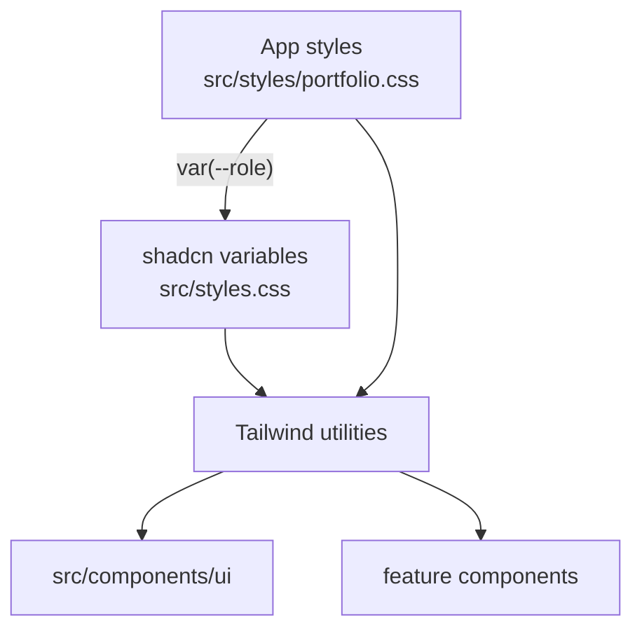

# 0007: shadcn/ui as the component and token base

Date: 2026-10-05
Status: Accepted

## Context

The portfolio needs accessible UI primitives and a theme system, but also its own visual identity (the Rence Portfolio design system). The owner decided on 2026-10-05 that shadcn is the base for tokens, with the application adding its own styles on top. [Decision 0002](0002-portfolio-design-tokens.md) records how the two token layers are joined; this record covers the choice of shadcn itself.

## Decision

Use shadcn/ui as the component and token foundation:

- [../../components.json](../../components.json): style `base-mira` (Base UI primitives from `@base-ui/react`), CSS variables on, Phosphor icons, `src/styles.css` as the theme file.
- shadcn variable names (`--background`, `--primary`, `--border`, `--ring`…) are the shared vocabulary. Components and Tailwind utilities use them (`bg-background`, `text-muted-foreground`).
- The application's own styles sit beside them in [../../src/styles/portfolio.css](../../src/styles/portfolio.css): palette, semantic roles, type scale, and utilities such as `page-grid` and `type-label`. Feature-specific CSS, such as [../../src/styles/intro.css](../../src/styles/intro.css), lives in `src/styles/`.
- Primitives added with the shadcn CLI go in `src/components/ui/` and are restyled through tokens, not by editing their class strings in feature code.

## Alternatives

None were recorded beyond the token-layering options in [0002](0002-portfolio-design-tokens.md).

## Consequences

- Primitives come with accessibility behavior from Base UI and can be added with `shadcn add`.
- shadcn CLI runs can overwrite `:root` values in `src/styles.css`; diff the file afterwards ([0002](0002-portfolio-design-tokens.md)).
- `components.json` still names `@/components` and `@/hooks`, but `tsconfig.json` only defines `#/*`. Check import paths in files the CLI generates.
- Design-system rules are checked by Oxlint with `@shadcn/lint` ([0001](0001-oxlint-for-design-system-lint.md)).

## Validation

On 2026-10-05, `bun --bun run lint:ds` and `bun --bun run build` passed. Rendering checks for the token layering are recorded in [0002](0002-portfolio-design-tokens.md).
