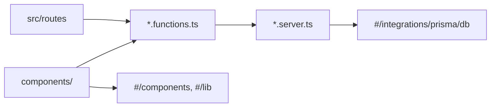

# 0009: Feature-based folder structure

Date: 2026-10-05
Status: Accepted

## Context

The source already grouped most code by feature (`projects`, `skills`, `public`, `site`), but the conventions were unwritten and applied unevenly. On 2026-10-05 the owner made the layout a rule: each feature keeps its server code, server functions, utilities, types, and components together, with a small global layer for shared code.

## Decision

Group code by feature under `src/features/<feature>/`. Within a feature, the file suffix states the role:

| Path | Role |
| --- | --- |
| `<feature>.server.ts` | Server-only functions, including all database access. Never imported by client code. |
| `<feature>.functions.ts` | Server functions (`createServerFn`) that routes and components call. They wrap `.server.ts` functions. Return plain data, not JSX ([0011](0011-no-react-server-components.md)). |
| `<feature>.utils.ts` or `utils/` | Extra helpers for that feature |
| `<feature>.types.ts` or `types/` | Types for that feature |
| `components/` | React components for that feature, optionally grouped in subfolders |

Code shared across features goes in the global folders, alongside TanStack Start's own files:

| Path | Role |
| --- | --- |
| `src/components/` | Shared components (`Navbar`, `Footer`) |
| `src/components/ui/` | shadcn primitives ([0007](0007-shadcn-component-and-token-base.md)) |
| `src/lib/` | Shared utilities (`utils.ts` with `cn()`, `gsap.ts`) |
| `src/integrations/` | Third-party wiring (Prisma, TanStack Query) |
| `src/styles.css`, `src/styles/` | Global styles and tokens |
| `src/routes/`, `src/router.tsx`, `src/routeTree.gen.ts` | TanStack Start routing ([0006](0006-tanstack-start-application-stack.md)) |

```text
src/features/projects/
├── projects.server.ts      # db queries (server only)
├── projects.functions.ts   # createServerFn wrappers
├── projects.utils.ts       # helpers
├── projects.types.ts       # types
└── components/
    └── ProjectCard.tsx
```



Import across folders with the `#/` alias (`#/features/projects/projects.server`).

## Alternatives

None were recorded.

## Consequences

- TanStack Start's import protection blocks `*.server.*` files from the client bundle by default, so the suffix also enforces the server boundary in `AGENTS.md`.
- Routes stay thin: they compose feature components and call `*.functions.ts`.
- One feature may call another feature's `.server.ts` from its own server code; `public.server.ts` does this for projects and skills.
- The existing source does not fully follow this yet:
  - `src/features/public/lib/intro.ts` holds feature helpers in `lib/` instead of `utils/` or `public.utils.ts`.
  - `src/features/projects/projects.functions.ts` is empty, and `skills` has no `.functions.ts`.

  Align these when the files are next changed; they do not block other work.

## Validation

On 2026-10-05, the source tree was inspected against this layout, with the deviations listed above. The installed `@tanstack/start-plugin-core` denies `**/*.server.*` in the client environment by default. No build-time violation was triggered to test it.
