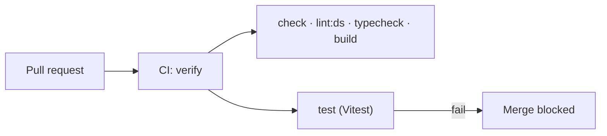

# 0010: Vitest, with tests in every pull request

Date: 2026-10-05
Status: Accepted

## Context

The project had no test suite. The admin dashboard needs its edge cases checked automatically: unique slugs and ranks, restricted deletes, the owner-only guard, and stale edits ([intent](../intent.md#admin-dashboard)). On 2026-10-05 the owner decided that every pull request must include tests and that the test runner is Vitest, for its speed and its integration with Vite.

## Decision

Use **Vitest** as the test runner, and require tests in every pull request that changes behavior.

| Rule | Detail |
| --- | --- |
| Runner | Vitest, configured in `vitest.config.ts` |
| Script | `bun --bun run test` runs `vitest run`; `verify` runs it after the other checks |
| Placement | Tests sit beside the code they cover: `projects.server.test.ts` next to `projects.server.ts` |
| Every PR | A PR that adds or changes behavior adds or updates tests for it. Docs-only and config-only PRs are exempt and say so in the description |
| CI | `verify`, and so the tests, runs on every PR and must pass to merge |
| Database | Tests never use the production database. Integration tests use a Neon branch or a local Postgres. |
| External services | Storage and other external services sit behind one `*.server.ts` module each; unit tests replace them with fakes |

```ts
// vitest.config.ts (sketch)
import { defineConfig } from "vitest/config";

export default defineConfig({
  resolve: { tsconfigPaths: true },
  test: {
    include: ["src/**/*.test.{ts,tsx}"],
    environment: "node",
  },
});
```

The test config is kept separate from `vite.config.ts`, so tests do not load the Nitro and TanStack Start plugins.



### Runtime for Vitest

Vitest runs on Node.js, the same runtime as production ([0005](0005-vercel-deployment.md)).

## Alternatives

- **`bun test`:** fast, but it runs tests on Bun while production runs on Node.js, and the owner chose Vitest for its Vite integration.
- **Tests only for risky changes:** cheaper, but the owner wants tests in every PR so coverage grows with the code.

## Consequences

- Every behavior PR costs a little more, and regressions show up in CI instead of in production.
- `verify` gets slower as tests grow. Keep unit tests fast and move slow database tests to a separate script if needed.
- The Claude PR review checks that behavior changes come with tests.

## Validation

Not yet implemented; tracked in Linear WD-8.
