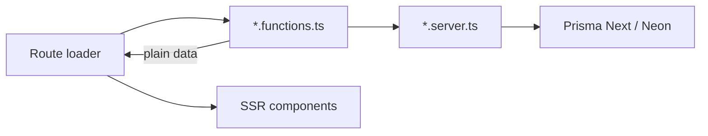

# 0011: No React Server Components for now

Date: 2026-10-05
Status: Accepted

## Context

The scaffold enabled TanStack Start's React Server Components (`tanstackStart({ rsc: { enabled: true } })` with `@vitejs/plugin-rsc`). The homepage renders its project and skill sections with `createCompositeComponent`.

TanStack marks server components as experimental ("will remain so into early v1"), and its helper APIs, including `createCompositeComponent`, "may see refinements". TanStack's own guidance treats RSCs as opt-in and server functions as the main way to load data. It recommends RSCs for content-heavy or dependency-heavy pages, and calls them a weak fit for interactive apps such as dashboards.

## Decision

Do not use React Server Components for now. Load data with server functions that return plain, serializable data, and render it with ordinary SSR React components.

```ts
// projects.functions.ts
export const getFeaturedProjectsFn = createServerFn().handler(() =>
  getFeaturedProjects({ limit: 3 }),
);

// routes/_public/index.tsx
loader: async () => {
  const [projects, skills] = await Promise.all([
    getFeaturedProjectsFn(),
    getTopSkillsFn(),
  ]);
  return { projects, skills };
},
```



Removing RSC from the code is tracked in Linear: replace `createCompositeComponent` and `CompositeComponent` on the homepage, remove `rsc` from `vite.config.ts` and the `@vitejs/plugin-rsc` dependency, and set `"rsc": false` in `components.json`.

## Alternatives

- **Keep RSC for public pages only:** TanStack's suggested sweet spot is content-heavy pages, but these pages are small and have few heavy dependencies, so the gain would be small. The cost is an experimental API that may change, an extra plugin, and Flight serialization limits.
- **RSC everywhere:** a poor fit for the interactive admin dashboard.

## Consequences

- Fewer experimental parts in the stack, and simpler data flow and tests ([0010](0010-vitest-tests-in-every-pr.md)).
- Server functions return serializable data. Components that need it are rendered on the server during SSR and hydrated on the client.
- Revisit when TanStack Start's RSC support is stable, or if case studies become content-heavy (markdown, syntax highlighting).

## Validation

Decision only. On 2026-10-05, TanStack's [server components guide](https://tanstack.com/start/latest/docs/framework/react/guide/server-components) and [RSC blog post](https://tanstack.com/blog/react-server-components) were reviewed. The code still uses RSC until the removal task is done.
