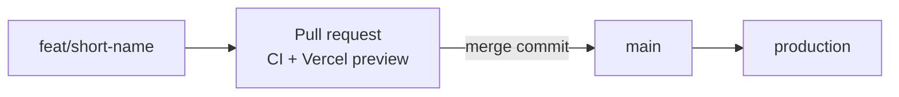

# 0012: Trunk-based pull request workflow

Date: 2026-10-05
Updated: 2026-10-05 (merge commits instead of squash merge, by owner decision)
Status: Accepted

## Context

Pushing `main` deploys production on Vercel ([0005](0005-vercel-deployment.md)), CI runs `verify` on every pull request ([0010](0010-vitest-tests-in-every-pr.md)), and work is tracked in Linear (team `me`, key `WD`). The owner wanted readable branch names, Linear issues referenced from the PR description because one PR can resolve several issues, and a decision on whether to keep a separate development branch.

## Decision

Work trunk-based: short-lived branches merge into `main` through pull requests. There is no `develop` branch until after launch.

| Rule | Detail |
| --- | --- |
| Branch names | `<type>/<short-name>`, with the conventional-commit type: `feat/navbar-links`, `fix/gate-cookie`, `ci/vitest-verify`, `refactor/remove-rsc`, `docs/git-workflow`. Not Linear's generated names. |
| Commits | Every commit on a branch is a conventional commit (`feat:`, `fix:`, `docs:`…), because merge commits keep them all in `main`'s history. |
| PR title | A conventional commit (`feat: add navbar links`); it becomes the description of the merge commit. |
| Linear links | In the PR description, one issue per line. `Closes WD-12` (or `Fixes`, `Resolves`) moves the issue to Done on merge; `Part of WD-13` or `Refs WD-21` only links it. |
| PR description | Follows [../../.github/pull_request_template.md](../../.github/pull_request_template.md): Linear, What, Tests, Checks, Not checked. |
| Merge | Merge commit ("Create a merge commit") after CI passes. The owner merges. |
| Stacked PRs | Allowed when one change needs another: base the second PR on the first PR's branch, and rebase it onto `main` after the first merges. |
| Renaming | Never rename a branch that has an open PR: GitHub closes the PR. |

## Alternatives

- **`develop` + `main` (Git Flow-style):** a fixed staging URL for testing merged features together. Rejected for now: every change would need two merges, the branches drift, and each needs CI and protection. Until launch, production is behind the coming-soon gate, so `main` already acts as staging, and every PR has its own Vercel preview. Revisit after launch (Linear WD-50).
- **Squash merge:** one commit per PR on `main`, but the owner chose merge commits, which keep each branch's commits.
- **Linear IDs in branch names or PR titles:** links automatically, but one PR often resolves several issues, and generated branch names are long.

## Consequences

- One merge per change. `main` keeps every branch commit plus a merge commit per PR, so commit messages on branches matter.
- Closing keywords keep Linear in sync without manual status changes.
- Branch protection on `main` (required `verify`, merge commits allowed, auto-delete branches, no direct pushes) completes this workflow; tracked in Linear WD-4.
- [0014](0014-vercel-deploys-main-and-development-only.md) limits Vercel deployments to `main` and `development`, so a pull request from any other branch has no Vercel preview, unlike the per-PR previews assumed above.

## Validation

On 2026-10-05, PRs #1 and #2 were closed by renaming their branches and reopened as #3 (`ci/vitest-verify`) and #4 (`refactor/remove-rsc`), which use this format. Branch protection is not yet applied.
