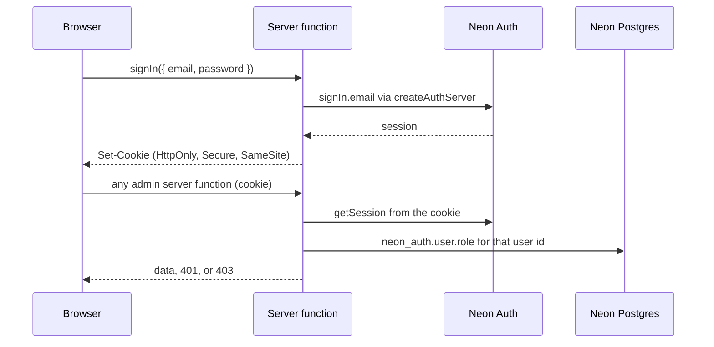

# 0013: Admin authentication and authorization

Date: 2026-10-08
Status: Proposed

## Context

The admin dashboard lets the owner create, edit, and delete all content ([intent](../intent.md#admin-dashboard)), so every admin page and every admin server function needs a security boundary before any of it is built (Linear WD-16 blocks WD-17 sign-in and WD-18 the guard).

Already settled: Neon Auth (Better Auth) is provisioned in the `neon_auth` schema, the owner's row has `role = 'admin'` in `neon_auth.user`, and there is no app table for admins ([0003](0003-neon-database-and-portfolio-schema.md)). The coming-soon gate is not authentication ([architecture](../architecture.md#coming-soon-gate)).

On 2026-10-08 the owner confirmed the decisions listed in WD-16 (one shared `requireAdmin()`, admin URLs under `_dashboard`, no sign-up, owner account only) and chose **email/password** as the sign-in method. The issue gave `/admin/...` and `/admin/sign-in` only as examples, so the `/admin` prefix below is proposed here, not separately confirmed.

What `@neondatabase/auth` offers for a server framework (version `0.5.0-beta`, read from the published package):

- `@neondatabase/auth/server` is a framework-agnostic **beta** toolkit. `createAuthServer` returns Better Auth server methods (`signIn.email`, `getSession`, `signOut`) that resolve to `{ data, error }`. The app supplies a `RequestContext` that reads and writes cookies for its framework.
- The bundled adapter is for Next.js. A TanStack Start adapter is in progress upstream, so this app writes a small one.
- Configuration is `NEON_AUTH_BASE_URL` (the Neon Auth service) and `NEON_AUTH_COOKIE_SECRET` (signs the cached session-data cookie, which lives for `sessionDataTtl` seconds).
- Neon Auth runs Better Auth's admin plugin, whose roles are `"user"` and `"admin"`.

## Decision

**Sign-in is email/password for the single owner account. There is no sign-up.** Sign-in, sign-out, and session reads go through the app's own server functions, so the browser never talks to Neon Auth and the app mounts no `/api/auth/*` proxy.



| Concern | Decision |
| --- | --- |
| Session transport | Cookies set by `createAuthServer` through a TanStack Start `RequestContext` (`getCookie`, `setCookie`, request headers). `HttpOnly`, `Secure` in production, `SameSite=Lax` or stricter. No token in JavaScript-readable storage. |
| Sign-up | None. No sign-up page, no sign-up server function, and no `/api/auth/*` route that could forward one. The owner account already exists. |
| Authorization | The session proves who the user is; `neon_auth.user.role = 'admin'` decides what they may do. `requireAdmin()` reads the role from the database for the verified user id on every call, because the cached session-data cookie can be stale for `sessionDataTtl`. |
| Shared guard | One `requireAdmin()` in `src/features/auth/auth.server.ts`. Every admin server function calls it first, itself. It throws for a missing session (401) or a non-admin user (403), and returns the admin user otherwise. |
| Route guard | A UX layer, not the boundary. `beforeLoad` on the `_dashboard` layout calls a server function (as `_public` does with `getSiteGate`) and redirects signed-out users to sign-in. A signed-in non-admin gets a 403 page. Calling a server function directly never relies on a route guard. |
| Admin URLs | Everything under `/admin`: `/admin` home, `/admin/projects` and the other content types, and `/admin/sign-in`. |
| Layout | The sign-in route lives outside the guarded `_dashboard` layout, so redirecting signed-out users cannot loop. All other admin routes are children of `_dashboard`. |
| Gate | `_dashboard` is outside the coming-soon gate in `_public`, so the owner can sign in while the public site is gated. |
| Indexing | Admin pages are `noindex`. |
| Redirect target | The sign-in page accepts a `redirect` search param only for a path that starts with `/admin`; anything else goes to `/admin`. |
| Errors | Wrong credentials show one message that does not reveal whether the account exists. |
| Config | `NEON_AUTH_BASE_URL` and `NEON_AUTH_COOKIE_SECRET` are server-only variables set per Vercel environment, never committed. `sessionDataTtl` is kept short (minutes). |
| Files | `src/features/auth/` follows [0009](0009-feature-folder-structure.md): `auth.server.ts` (server factory, `RequestContext`, `requireAdmin`), `auth.functions.ts` (`signIn`, `signOut`, session check for `beforeLoad`), `components/` (sign-in form). The admin content features call `requireAdmin()` from their own `*.functions.ts`. |

```ts
// src/features/<feature>/<feature>.functions.ts (intended shape)
export const deleteProject = createServerFn({ method: "POST" })
  .inputValidator(deleteProjectSchema)
  .handler(async ({ data }) => {
    await requireAdmin(); // always the first line
    return deleteProjectById(data.id);
  });
```

Four layers keep a stray or self-created Neon Auth user out of the dashboard: no sign-up UI, no proxy route that could forward a sign-up, the role check on every call, and (to be confirmed in WD-17) sign-up disabled in the Neon Auth settings.

## Alternatives

- **GitHub OAuth:** no password to manage, but every Vercel preview origin needs its callback registered with the GitHub OAuth app, and implicit sign-up must be blocked so only the owner's linked account works.
- **Magic link:** no password, but it needs working email delivery and a callback per preview origin, and the mailbox becomes the single point of failure.
- **Browser talks to Neon Auth directly** (`createAuthClient` with the Neon Auth URL, then a JWT sent to server functions): server functions would need to verify tokens themselves, and the Neon Auth sign-up endpoint stays reachable from the browser's own requests.
- **Mount a `/api/auth/*` proxy** (what the Next.js adapter does): needed for OAuth callbacks and client-side `useSession`, neither of which this app uses. It would expose every upstream endpoint, including sign-up, unless an allowlist is maintained.
- **Authorize from the cached session's role:** saves one query per call, but a demoted or removed admin keeps access until the cache expires. One indexed read for a single-owner site is cheap.
- **Attach the guard as server-function middleware instead of calling `requireAdmin()`:** WD-18 requires each admin function to call it itself, which keeps the check visible at the top of every handler and straightforward to unit test.
- **A custom auth implementation or another provider:** rejected; Neon Auth is already provisioned and holds the owner account ([0003](0003-neon-database-and-portfolio-schema.md)).

## Consequences

- Sign-in and the guard are implemented in WD-17 and WD-18. This record changes no code.
- The `signIn` server function is a public password endpoint. If Neon Auth does not already rate-limit failed sign-ins, WD-17 adds rate limiting before the sign-in page ships.
- The existing placeholder routes `src/routes/_dashboard/auth` and `src/routes/_dashboard/home` use URLs outside `/admin`; WD-17 and WD-19 replace them.
- `@neondatabase/auth` must be pinned to an exact version: its `/server` subpath is beta, and minor versions may break it. Prefer the upstream TanStack Start adapter if it ships.
- The app reads `neon_auth.user` only to look up `role`, and never writes to the `neon_auth` schema. The Prisma contract has no `neon_auth` model today; how to run that query is decided in WD-18, and any contract change needs the owner's approval ([data](../data.md#schema-changes)).
- There is no in-app password reset or sign-up. If the password is lost, recovery is an owner action in Neon, which WD-17 should document once verified.
- Tests for WD-18 cover signed-out (401), non-admin (403), and admin calls ([0010](0010-vitest-tests-in-every-pr.md)).

## Validation

Decision only; nothing was run against Neon Auth. The facts about `@neondatabase/auth` come from its published README and adapter guide (`0.5.0-beta`), because the sandbox could not reach `neon.com`. Not yet verified, to settle in WD-17 on a Vercel preview with its own Neon branch:

- `signIn.email` called through `createAuthServer` sets the session cookies via the TanStack Start `RequestContext`, and a later request reads the session back.
- Whether the preview origin must be added to Neon Auth's trusted origins, and whether sign-up can be disabled in the Neon Auth settings.
- A newly created Neon Auth user defaults to `role = 'user'`.
- The default `sessionDataTtl`, the session lifetime, and whether Neon Auth rate-limits repeated failed sign-ins.
- The exact `neon_auth.user` column names used by the role query.
