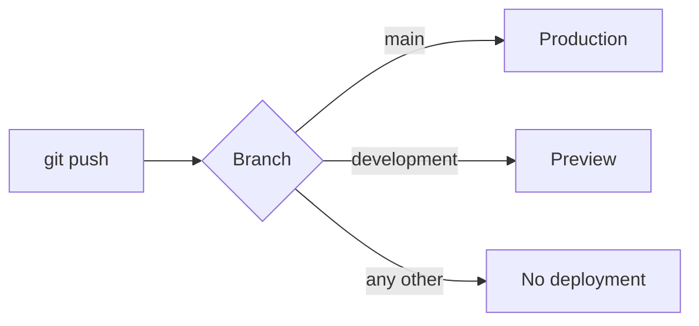

# 0014: Vercel deploys only `main` and `development`

Date: 2026-10-09
Status: Accepted

## Context

Vercel's Git integration deploys every pushed branch: `main` to production and every other branch to a login-protected preview ([0005](0005-vercel-deployment.md)). The owner wants previews for one branch, `development`, instead of for every branch.

## Decision

Turn deployments off for every branch except `main` and `development` with `git.deploymentEnabled` in [../../vercel.json](../../vercel.json):

```json
{
  "git": {
    "deploymentEnabled": {
      "**": false,
      "main": true,
      "development": true
    }
  }
}
```



- Vercel treats branches that no rule names as enabled, so the `**: false` catch-all is required.
- `**` also matches `main`, so `main: true` must stay or pushes to `main` stop deploying production.
- The catch-all is `**`, not `*`: the patterns are minimatch globs, `*` does not match `/`, and branches here are `<type>/<short-name>` ([0012](0012-trunk-based-pr-workflow.md)).
- A branch that matches several rules deploys when any matching rule is `true`.

The conventions for editing the rule and for scoping Preview environment variables to a branch are in [../development.md](../development.md#vercel).

## Alternatives

- **Deploy every branch (previous behavior):** each pull request got its own preview.
- **Ignored Build Step** (Settings → Git, or `ignoreCommand` in `vercel.json`): a command that Vercel runs for each push; exit code 0 skips the build and 1 runs it. The branch allowlist would live in a shell string instead of in declarative config.

## Consequences

- A push to any branch except `main` and `development` creates no deployment, so its pull request shows no Vercel preview. [../sdlc.md](../sdlc.md#git-workflow) reflects this.
- Previews exist only while a `development` branch exists. [0012](0012-trunk-based-pr-workflow.md) has no `development` branch until after launch (Linear WD-50) and describes branches merged straight into `main`. Follow-up: decide how pull requests relate to `development`.
- A new branch that should deploy needs its own `true` rule in `vercel.json`.
- Preview environment variables can be scoped to `development`, so its previews can use their own values, such as `DATABASE_URL`.

## Validation

Not verified: that a push to a `<type>/<short-name>` branch creates no deployment (this relies on `**` matching `/`), and that a push to `main` still deploys production.
