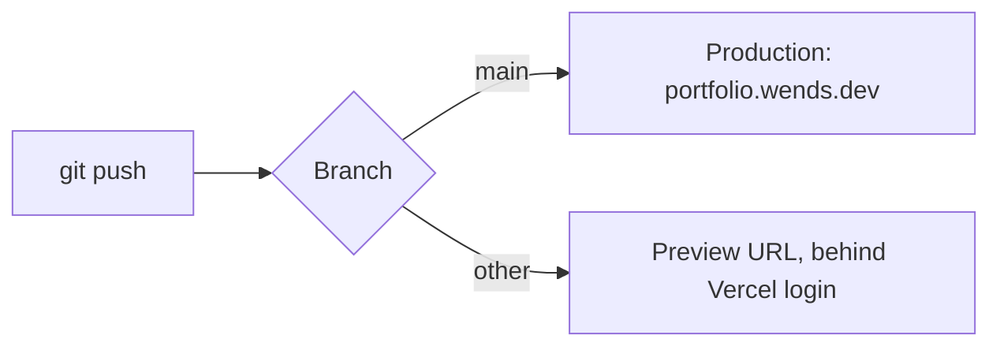

# Development

Setup, commands, checks, and deployment.

## Local setup

Use Bun (`bun.lock`). The database is PostgreSQL 15 or newer on Neon.

```bash
bun install
# If .env does not exist, copy .env.example to .env and set DATABASE_URL.
bun --bun run dev
```

The dev server runs on port **3000**. `DATABASE_URL` must point at the Neon database before pages that read data can load. See [data](data.md#database).

## Available scripts

| Command | Configured action |
| --- | --- |
| `bun --bun run dev` | Vite development server on port 3000 |
| `bun --bun run build` | Vite production build |
| `bun --bun run preview` | Vite preview |
| `bun --bun run generate-routes` | `tsr generate` |
| `bun --bun run lint` | Biome lint |
| `bun --bun run format` | Biome format |
| `bun --bun run check` | Biome check |
| `bun --bun run lint:ds` | Oxlint with the configured shadcn plugin |
| `bun --bun run typecheck` | TypeScript check without emitting files |
| `bun --bun run test` | Vitest, once (runs on Node.js) |
| `bun --bun run test:watch` | Vitest in watch mode |
| `bun --bun run verify` | Sequential check, lint:ds, typecheck, test, and build; nonzero if any fail |
| `bun --bun run contract:emit` | Prisma contract emission |

Biome 2.5.15 (CLI and `biome.json` schema) scopes its checks through [../biome.json](../biome.json); it includes `scripts/**/*.mjs` and excludes the generated route tree, the stylesheets, and `.delta/` (tool-managed clones whose nested `biome.json` otherwise stops Biome with a "nested root configuration" error). The scripts do not pass `--write`; add it only when you intend to change files.

Two linters run side by side and do not overlap ([decision 0008](decisions/0008-biome-linter-and-formatter.md), [decision 0001](decisions/0001-oxlint-for-design-system-lint.md)):

| Tool | Config | Owns |
| --- | --- | --- |
| Biome | [../biome.json](../biome.json) | Formatting, import order, general lint rules |
| Oxlint + `@shadcn/lint` | [../.oxlintrc.json](../.oxlintrc.json) | Design-system rules only; Oxlint's default `correctness` category is turned off |

`@shadcn/lint` reads [../components.json](../components.json) to discover components and theme tokens. See [UI conventions](ui.md#design-system-linting).

Do not use the `db:*` scripts in `package.json`; they are traditional Prisma commands. Use the Prisma Next commands in [data](data.md#schema-changes).

## Validation

Pick checks that fit the change:

```bash
bun --bun run verify   # Biome check, lint:ds, typecheck, Vitest, build
bun run test           # tests only
```

Tests use Vitest ([decision 0010](decisions/0010-vitest-tests-in-every-pr.md)) and live next to the code as `*.test.ts`. Every pull request that changes behavior includes tests. [../vitest.config.ts](../vitest.config.ts) is separate from `vite.config.ts`, so tests don't load the Nitro or TanStack Start plugins. Tests run on Node.js, like production: `verify` starts the test step without Bun's `node` shim.

[../scripts/verify.mjs](../scripts/verify.mjs) runs every check from the repository root, keeps going after a failure, and exits 1 if any check fails. It never touches the database.

### CI

[../.github/workflows/ci.yml](../.github/workflows/ci.yml) runs `verify` on every pull request and every push to `main`. It installs the Bun version pinned in `package.json` (`packageManager`) and Node.js 24 for the tests. It also runs `bun audit` before `verify` as a non-blocking step: advisories show in the log but don't fail the job, because `braces` has no fix yet.

`verify` must pass before a change is done. Report results in chat or the PR, not in these docs. For UI work, also check affected pages on small screens and with the keyboard. See [sdlc.md](sdlc.md#verification-by-change-type).

## Generated files

- Edit route files, then use route generation; do not manually patch `src/routeTree.gen.ts`.
- Edit `src/integrations/prisma/contract.ts`, then emit its generated `contract.json` and `contract.d.ts`. Emission does not apply database migrations.
- Treat migration snapshots and references as tool-managed artifacts. Do not rewrite migration history casually.
- Keep `bun.lock` aligned with intentional dependency changes. Several dependency ranges use `latest`; inspect installed versions before applying version-specific advice.
- Use `#/` imports ([../tsconfig.json](../tsconfig.json) maps `#/*` to `src/*`; there is no `@/*`). Check imports in files the shadcn CLI generates, since `components.json` still names `@/` for some aliases.

## Dependency overrides

`package.json` pins transitive packages through `overrides`. Four are security fixes: `@hono/node-server`, `hono`, and `valibot` (under `@prisma/dev`) and `lodash` (under Chevrotain); `arktype` is also pinned. Remove each security override once its parent package ships a safe version. `braces` (under `fast-glob` → `micromatch`) has a high advisory with no fix published; update it when one appears.

```bash
bun audit
```

CI runs `bun audit` on every pull request without failing the job ([CI](#ci)).

### Dependabot

[../.github/dependabot.yml](../.github/dependabot.yml) configures two update streams:

| Ecosystem | Schedule | Pull requests |
| --- | --- | --- |
| `bun` (package.json + bun.lock) | Monthly | `open-pull-requests-limit: 0`: npm version updates are switched off, so Dependabot neither opens PRs nor reports outdated packages. Run `bun outdated` to check by hand. Raising the limit groups minor and patch updates into one `chore:` PR. |
| `github-actions` | Weekly | One grouped `ci:` PR for all action updates |

To start receiving npm update PRs, raise `open-pull-requests-limit`. CI runs on Dependabot PRs like any other. Workflows triggered by Dependabot can't read repository secrets, so any workflow that needs one must skip Dependabot PRs.

## Build output and deployment

`bun --bun run build` writes a Nitro server to `.output/` (gitignored). No preset is set in `vite.config.ts`, so Nitro picks one from the environment: `bun` locally, `vercel` on Vercel. To run the local build:

```bash
bun run .output/server/index.mjs
```

### Vercel

The site deploys on Vercel ([decision 0005](decisions/0005-vercel-deployment.md)) through its Git integration:



[../vercel.json](../vercel.json) sets the install and build commands. Production runs on Vercel's Node.js runtime ([decision 0005](decisions/0005-vercel-deployment.md)), pinned with `vercel.functions.runtime: "nodejs24.x"` in the Nitro config because the build runs under Bun. Application code must not use Bun-only APIs such as `Bun.s3`:

```json
{
  "installCommand": "bun install --frozen-lockfile",
  "buildCommand": "bun --bun run build"
}
```

Set these environment variables in the Vercel project for each environment that needs them; never commit their values:

| Variable | Needed for |
| --- | --- |
| `DATABASE_URL` | Every page that reads the database. Preview deployments without it fail with a database error while reading the contract marker. |
| `COMING_SOON`, `PREVIEW_TOKEN` | The [coming-soon gate](architecture.md#coming-soon-gate) |

To reproduce the Vercel build locally, which writes the ignored `.vercel/output/` (check `functions/__server.func/.vc-config.json` shows a `nodejs` runtime):

```bash
NITRO_PRESET=vercel bun --bun run build
```

After a deploy, confirm the production deployment succeeded and `/` (or `/coming-soon` when gated) responds.

Pushing to `main` deploys to production. Push to `main` only when the owner asks.
