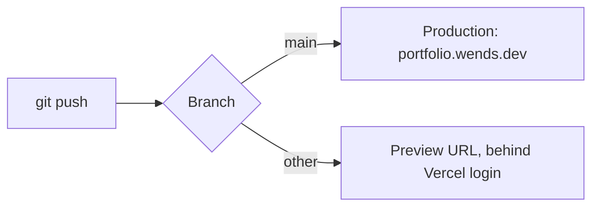

# Development

Source snapshot: **2026-10-05**. Commands come from repository scripts and configuration. The checks in [Validation](#validation) were run on 2026-10-05; their results are recorded there.

## Local setup

The repository includes `bun.lock`, and the starter uses Bun. PostgreSQL 15 or newer is specified in [../.env.example](../.env.example) and [../prisma-next.md](../prisma-next.md). No Bun or Node version pin was found in the inspected configuration.

```bash
bun install
# If .env does not exist, copy .env.example to .env and set DATABASE_URL.
bun --bun run dev
```

The dev script requests port **3000**. `DATABASE_URL` must point at the Neon database before the homepage can load; nothing provisions a database automatically. See [data](data.md#active-database-path).

## Available scripts

| Command | Configured action |
| --- | --- |
| `bun --bun run dev` | Vite development server on port 3000 |
| `bun --bun run build` | Vite production build |
| `bun --bun run preview` | Vite preview |
| `bun --bun run generate-routes` | `tsr generate` |
| `bun --bun run lint` | Biome lint |
| `bun --bun run format` | Biome format |
| `bun --bun run check` | Biome check |
| `bun --bun run lint:ds` | Oxlint with the configured shadcn plugin |
| `bun --bun run typecheck` | TypeScript check without emitting files |
| `bun --bun run verify` | Sequential check, lint:ds, typecheck, and build; nonzero if any fail |
| `bun --bun run contract:emit` | Prisma contract emission |

Biome 2.5.15 (CLI and `biome.json` schema) scopes its checks through [../biome.json](../biome.json); it includes `scripts/**/*.mjs` and excludes the generated route tree, the stylesheets, and `.delta/` (tool-managed clones whose nested `biome.json` otherwise stops Biome with a "nested root configuration" error). Generated Prisma JSON and types are still included, so generated-file findings remain possible. The scripts do not pass `--write`. Use an explicit write option only when formatting changes are intended.

Two linters run side by side and do not overlap:

| Tool | Config | Owns |
| --- | --- | --- |
| Biome | [../biome.json](../biome.json) | Formatting, import order, general lint rules |
| Oxlint + `@shadcn/lint` | [../.oxlintrc.json](../.oxlintrc.json) | Design-system rules only; Oxlint's default `correctness` category is turned off |

`@shadcn/lint` reads [../components.json](../components.json) to discover components and theme tokens. No `shadcn/*` rules are enabled yet, so `lint:ds` currently verifies setup only. See [UI conventions](ui.md#design-system-linting) and [decision 0001](decisions/0001-oxlint-for-design-system-lint.md).

`package.json` also contains `db:generate`, `db:push`, `db:migrate`, `db:studio`, and `db:seed`. These use traditional Prisma command names, while the active configuration uses Prisma Next contracts. Their compatibility and seed configuration have not been verified. See [data](data.md) before using them.

## Validation

There is no configured test script or test suite. Select checks appropriate to the change. For TypeScript or UI work:

```bash
bun --bun run check
bun --bun run lint:ds
bun --bun run typecheck
bun --bun run build
```

Or run all four with `bun --bun run verify`. [../scripts/verify.mjs](../scripts/verify.mjs) runs from the repository root, prints command output and individual results, continues after ordinary failures, and exits 1 if any check fails or cannot start. All passing checks produce exit 0; interruption stops the runner. Builds write ignored output and may regenerate route artifacts; this command does not run database-changing scripts. See [sdlc.md](sdlc.md) for change planning and evidence requirements.

### Baseline (2026-10-05)

`bun --bun run verify` with Bun 1.3.14 on the `main` working tree:

| Check | Result |
| --- | --- |
| `bun --bun run check` | Fails, exit 1 |
| `bun --bun run lint:ds` | Passes; no `shadcn/*` rules enabled |
| `bun --bun run typecheck` | Passes |
| `bun --bun run build` | Passes; writes `.output/` with Nitro's `bun` preset |
| `bun --bun run verify` | Fails, exit 1, because `check` fails |

Record actual results and separate existing failures from regressions. Update this table when the baseline changes. For UI work, also inspect affected pages, responsive behavior, and keyboard interactions. Documentation-only work needs source accuracy and link checks; it does not require database operations.

The runner was tested on 2026-10-04 with temporary fixtures: all-pass (exit 0), first or last command failing (exit 1, all checks still run), missing Bun (exit 1, startup failures reported), and SIGTERM (exit 143, later checks skipped). It runs from the repository root even when launched elsewhere.

## Generated files

- Edit route files, then use route generation; do not manually patch `src/routeTree.gen.ts`.
- Edit `src/integrations/prisma/contract.ts`, then emit its generated `contract.json` and `contract.d.ts`. Emission does not apply database migrations.
- Treat migration snapshots and references as tool-managed artifacts. Do not rewrite migration history casually.
- Keep `bun.lock` aligned with intentional dependency changes. Several dependency ranges use `latest`; inspect installed versions before applying version-specific advice.

[../tsconfig.json](../tsconfig.json) maps `#/*` to `src/*`; use `#/` imports. There is no `@/*` alias. `components.json` aliases may still name `@/`, so check imports after running the shadcn CLI.

## Dependency security (2026-10-04)

The dependency-remediation checkout initially had no local `node_modules` or `bun.lock`. Installing the existing manifest with Bun 1.3.14 established a baseline of **58 advisories across 10 package names** (2 critical, 9 high, 44 moderate, 3 low).

Removed `biome@0.3.3`, an unused environment-variable manager unrelated to the configured `@biomejs/biome` formatter. This removed `request` and its exclusively owned vulnerable dependencies. Four transitive security overrides supersede upstream pins while retaining their major versions:

| Package | Final resolution | Parent requiring remediation |
| --- | --- | --- |
| `@hono/node-server` | `1.19.17` | `@prisma/dev@0.20.0` |
| `hono` | `4.13.13` | `@prisma/dev@0.20.0` |
| `lodash` | `4.18.1` | Chevrotain packages |
| `valibot` | `1.5.0` | `@prisma/dev@0.20.0` |

The final audit reports **one high advisory**: `braces@3.0.3`, [GHSA-vfj7-8cjw-p6xm](https://github.com/advisories/GHSA-vfj7-8cjw-p6xm). The advisory and registry show no published patched version as of this check. Its path is shadcn/Prisma tooling → `fast-glob` → `micromatch` → `braces`. The audit remains exit 1; no advisory is ignored. Revisit when an upstream fix is available, and remove overrides once the parent packages resolve safe versions themselves.

```bash
bun install --frozen-lockfile
bun audit
bun audit --json
bun --bun run verify
```

Historical verification on 2026-10-04: frozen installation passed without changing the lockfile. Production build and design-system lint passed before and after remediation. Prisma and shadcn CLI help commands and dependency smoke checks (Hono, Valibot, Lodash) passed; no database connection was opened.

## Build output and deployment

Locally, `bun --bun run build` writes a Nitro server to `.output/` (gitignored). No preset is set in `vite.config.ts`, so Nitro picks one from the environment: `bun` locally, `vercel` on Vercel. To run the local build:

```bash
bun run .output/server/index.mjs
```

### Vercel

The site deploys on Vercel ([decision 0005](decisions/0005-vercel-deployment.md)) through its Git integration:



[../vercel.json](../vercel.json) sets the install and build commands and `bunVersion`. Nitro reads `bunVersion` and sets the function runtime to Bun (`bun1.x`) instead of Node.js:

```json
{
  "bunVersion": "1.x",
  "installCommand": "bun install --frozen-lockfile",
  "buildCommand": "bun --bun run build"
}
```

Set these environment variables in the Vercel project for each environment that needs them; never commit their values:

| Variable | Needed for |
| --- | --- |
| `DATABASE_URL` | Every page that reads the database. Preview deployments without it fail with a database error while reading the contract marker. |
| `COMING_SOON`, `PREVIEW_TOKEN` | The coming-soon gate; see [architecture](architecture.md#routes) for its current behavior |

To reproduce the Vercel build locally, which writes the ignored `.vercel/output/`:

```bash
NITRO_PRESET=vercel bun --bun run build
```

On 2026-10-05 that build passed and `.vercel/output/functions/__server.func/.vc-config.json` recorded `"runtime": "bun1.x"`. Deployments before `vercel.json` used Vercel's defaults (Node.js runtime). A deployment with the Bun runtime has not been checked yet. After the first push, confirm the production deployment succeeds and `/` (or `/coming-soon` when gated) responds.

Pushing to `main` deploys to production. Push to `main` only when the owner asks.
