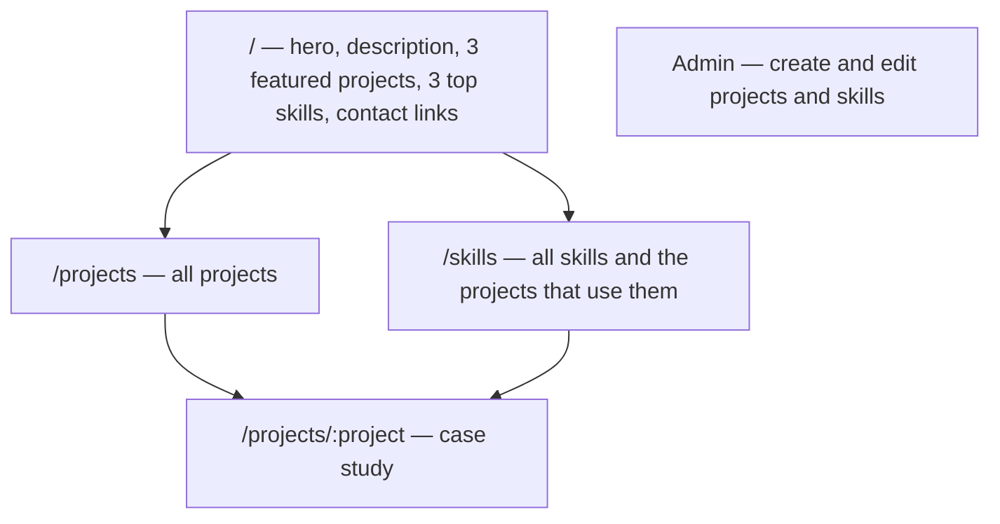

# Product intent

Agreed with the owner: **2026-10-04**. This document states what the portfolio should become. It is a target, not a description of current behavior; see [current status](status.md) for what exists. When intent and code disagree, the code is the current behavior and this document is the direction.

## Purpose

`wends.dev` is a personal showcase. A visitor should be able to confirm experience and stack quickly, then leave or go deeper. Success means credentials are easy to verify without hunting.

The work itself is the proof: projects, the skills they demonstrate, and a downloadable resume. There is no separate experience timeline or certifications section.

## Audience and tone

- **Audience:** primarily the owner, as a showcase of their work. Visitors checking credentials should still find what they need in seconds.
- **Visual direction:** clean and minimal. Typography-led, generous whitespace, restrained color. Use the existing semantic tokens in `src/styles.css`.

## Site structure

| Area | Intent |
| --- | --- |
| Homepage | Hero and description that establish who the owner is, three featured projects, three top skills, contact links, and a resume download |
| Projects | `/projects` lists all projects. Each project has a case-study page covering the problem, approach, and result |
| Skills | Reusable skills, each linked to the projects that used it |
| Contact | Links only (email, GitHub, LinkedIn, or similar). No form and no contact backend |
| Resume | A downloadable PDF |
| Content editing | A protected admin page for creating and editing projects and skills |

## Content rules

- **Featured order is manual.** The three featured projects and three top skills are chosen and ordered explicitly through an order field, not by date or computed ranking.
- **Projects and skills are many-to-many.** A project lists the skills it used; a skill shows the projects that used it.

## Non-goals

- Blog or long-form writing
- Visitor analytics or tracking
- Internationalization (English only)

Authentication is not a non-goal: the admin page needs it, for the owner only. Visitor accounts are out of scope.

## Gaps between intent and current code

Each item below is a known difference. Changing the data model or adding auth is significant; record the chosen approach in [decisions](decisions/README.md).

| Intent | Current state |
| --- | --- |
| Case-study page per project | `/projects/$` is a placeholder splat route. `getProjectBySlug` exists, but no route calls it. |
| Case study covers problem, approach, and result | The schema has only `description`. Separate fields were deferred ([decision 0003](decisions/0003-neon-database-and-portfolio-schema.md)). |
| Contact links and resume download | `ContactSection` is a placeholder and is not mounted; no `public/resume.pdf` exists |
| Admin page | No admin route. Neon Auth is provisioned, but the app does not use it yet. |
| Clean, minimal visual design | Landing components render placeholder text |

The data model now covers manual featured order (`featuredRank`, `topRank`) and the many-to-many link between projects and skills (`ProjectSkill`). See [data](data.md#models).

## Answered questions

Answered with the owner on 2026-10-04:

- **Admin authentication:** Neon Auth (Better Auth). The owner's user has `role = 'admin'` in `neon_auth.user`; no app table.
- **Case-study URLs:** a unique `slug` field, so URLs are `/projects/<slug>`.
- **Case-study content:** a `description` field for now; problem, approach, and result fields may come later.
- **Resume:** a static file at `public/resume.pdf`, replaced by commit.
- **Skills:** two levels. Categories (for example Web Development, with a 0–100 confidence) group individual skills (for example React). Projects link to individual skills, and the homepage's top skills are categories.
- **Collaborators:** projects can credit a team name and collaborators with optional roles.

## Open questions

- Which contact links should appear?
- Should the site offer a dark mode toggle? Dark tokens exist in `src/styles.css`, but no toggle does.

Answer these with the owner before implementing the affected area, then update this document.
