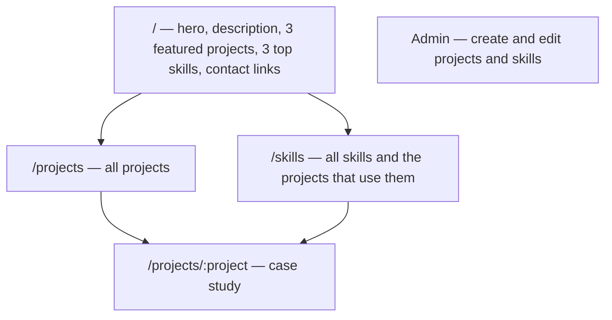

# Product intent

Agreed with the owner: **2026-10-04**. This document states what the portfolio should become. When the code differs, this document is the direction.

## Purpose

`wends.dev` is a personal showcase. A visitor should be able to confirm experience and stack quickly, then leave or go deeper. Success means credentials are easy to verify without hunting.

The work itself is the proof: projects, the skills they demonstrate, and a downloadable resume. There is no separate experience timeline or certifications section.

## Audience and tone

- **Audience:** primarily the owner, as a showcase of their work. Visitors checking credentials should still find what they need in seconds.
- **Visual direction:** clean and minimal. Typography-led, generous whitespace, restrained color. Use the existing semantic tokens in `src/styles.css`.

## Site structure

| Area | Intent |
| --- | --- |
| Homepage | Hero and description that establish who the owner is, three featured projects, three top skills, contact links, and a resume download |
| Projects | `/projects` lists all projects. Each project has a case-study page covering the problem, approach, and result |
| Skills | Reusable skills, each linked to the projects that used it |
| Contact | Links only: LinkedIn and GitHub. No form and no contact backend |
| Resume | A downloadable PDF |
| Content editing | A protected admin dashboard with full create, edit, and delete for all content; see [Admin dashboard](#admin-dashboard) |

## Content rules

- **Featured order is manual.** The three featured projects and three top skills are chosen and ordered explicitly through an order field, not by date or computed ranking.
- **Projects and skills are many-to-many.** A project lists the skills it used; a skill shows the projects that used it.

## Admin dashboard

Direction from the owner on 2026-10-05: a standard dashboard layout where the owner picks a content type, then adds, edits, or deletes entries. Full CRUD for everything, with edge cases handled.

| Content type | Operations |
| --- | --- |
| Projects | Create, edit, delete, publish/unpublish, set featured rank, attach skills, collaborators, and images |
| Skill categories | Create, edit, delete, set top rank and confidence |
| Skills | Create, edit, delete, move between categories |
| Collaborators | Create, edit, delete, link to projects with a role |
| Project images | Upload, reorder, edit alt text, delete |

Edge cases the dashboard must handle include:

- Duplicate slugs and duplicate ranks (both unique): show a clear error, or offer to swap ranks.
- Deleting a skill category that still has skills: blocked by the database; explain why and offer to move or delete the skills first.
- Deleting a project: confirm, and remove its images from storage as well as its rows.
- Unpublished projects: never shown publicly, even if ranked.
- Confidence outside 0–100, missing required fields (such as image `alt`), invalid URLs and dates (`endedAt` before `startedAt`).
- Concurrent edits and failed saves: no silent data loss.
- Only the owner (`neon_auth.user.role = 'admin'`) can reach the dashboard or call its server functions.

## Non-goals

- Blog or long-form writing
- Visitor analytics or tracking
- Internationalization (English only)

Authentication is not a non-goal: the admin page needs it, for the owner only. Visitor accounts are out of scope.

Changing the data model or adding auth is significant; record the chosen approach in [decisions](decisions/README.md).

## Answered questions

Answered with the owner on 2026-10-04:

- **Admin authentication:** Neon Auth (Better Auth). The owner's user has `role = 'admin'` in `neon_auth.user`; no app table.
- **Case-study URLs:** a unique `slug` field, so URLs are `/projects/<slug>`.
- **Case-study content:** a `description` field for now; problem, approach, and result fields may come later.
- **Resume:** a static file at `public/resume.pdf`, replaced by commit.
- **Skills:** two levels. Categories (for example Web Development, with a 0–100 confidence) group individual skills (for example React). Projects link to individual skills, and the homepage's top skills are categories.
- **Collaborators:** projects can credit a team name and collaborators with optional roles.

Answered with the owner on 2026-10-05:

- **Contact links:** LinkedIn and GitHub only, for now.
- **Dark mode:** light mode only for now. Dark mode is deferred to the week of 2026-10-12 (Linear WD-43).
- **Tests:** every pull request that changes behavior includes tests, run with Vitest ([decision 0010](decisions/0010-vitest-tests-in-every-pr.md)).
- **Runtime:** Node.js in production on Vercel; Bun stays the package manager and dev tool. No Bun-only runtime APIs ([decision 0005](decisions/0005-vercel-deployment.md)).
- **React Server Components:** not used for now; server functions return plain data ([decision 0011](decisions/0011-no-react-server-components.md)).

Answered with the owner on 2026-10-08:

- **Admin sign-in:** email and password for the owner's existing account only. There is no sign-up. Admin pages live under `/admin`, and one shared `requireAdmin()` guards every admin server function ([decision 0013](decisions/0013-admin-authentication-and-authorization.md)).

## Open questions

None at the moment. Add new ones here, and answer them with the owner before implementing the affected area.
