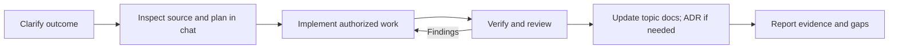
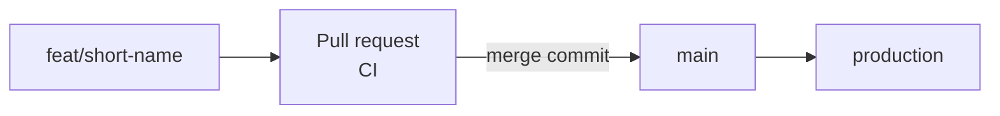

# Development workflow

This is a lightweight adaptation of [Anthropic's AI-native SDLC playbook](https://claude.com/blog/the-ai-native-sdlc-playbook), simplified with the owner on **2026-10-05**. The owner sets direction and authorizes work; agents inspect source, plan in chat, implement, and verify. Codex and Claude Code share [../AGENTS.md](../AGENTS.md) directly.

The full playbook recommends persistent intent, spec, and accepted plan artifacts. This project keeps the same planning and feedback steps while using chat for task plans, ADRs for significant architectural decisions, and topic docs for direction and conventions. Separate per-change file sets are not required. Chat plans are less durable than versioned plans; carry important outcomes into an issue or PR when one is used.

## Sources of truth

| Information | Home | Purpose |
| --- | --- | --- |
| Product direction | [intent.md](intent.md) | Portfolio goals and open product questions |
| Conventions and plans | Topic docs in [README.md](README.md) | Architecture, data, UI, and development rules |
| Current behavior | The source code | What is implemented today |
| Task scope and plan | Linear issue (team `me`, project Portfolio) and the current chat | Requested outcome, acceptance criteria, files, steps, risks |
| Architectural rationale | [decisions/](decisions/README.md) | Significant technical choices, alternatives, and consequences |
| Verification | Pull request description and CI | Actual results, existing failures, regressions, and limitations |

An ADR explains why an architectural choice was made; it does not replace a feature's requirements or proof that the feature works. Docs do not track implementation status. Update them when a convention, plan, or decision changes, and preserve actual owner decisions.

## Working on a task



1. **Clarify:** read the product intent and relevant docs. Establish the outcome, scope, constraints, and observable acceptance criteria. Resolve consequential questions before dependent work.
2. **Plan:** for substantial work, inspect source and prepare a plan in chat before implementing. Name files, steps, risks, and checks. Include code examples and diagrams where useful. Tiny reversible edits need only a clear task description and appropriate verification.
3. **Implement:** follow actual owner authorization. Once authorized, continue routine work within scope without repeated permission questions. Seek a decision when missing information, a consequential scope change, or an existing restriction requires it. Update the plan when the approach changes.
4. **Verify and review:** run appropriate checks, inspect the diff, and compare behavior with acceptance criteria. Fix new findings without weakening checks. Report actual results and remaining gaps.
5. **Document:** update affected topic docs when a convention or plan changes. Add or update an ADR for choices such as database architecture, authentication approach, rendering strategy, or deployment host. Ordinary feature edits and bug fixes do not automatically need an ADR.
6. **Deploy and maintain:** when deployment is authorized and configured, record the target, startup, smoke checks, and recovery approach. Local verification does not establish deployed behavior. Reported bugs and operational findings become new tasks; this process does not introduce visitor analytics.

## Git workflow

Trunk-based, through pull requests ([decision 0012](decisions/0012-trunk-based-pr-workflow.md)). There is no `develop` branch until after launch (Linear WD-50).



1. **Branch** from `main` as `<type>/<short-name>`: `feat/navbar-links`, `fix/gate-cookie`, `docs/git-workflow`. Don't use Linear's generated branch names.
2. **Commit** with conventional commits (`feat:`, `fix:`, `refactor:`, `docs:`, `ci:`, `chore:`, `test:`).
3. **Open a PR** whose title is a conventional commit. Fill in [the template](../.github/pull_request_template.md), and reference Linear issues in the description:

   ```text
   Closes WD-21
   Closes WD-22
   Part of WD-13
   ```

   `Closes`/`Fixes`/`Resolves` move the issue to Done on merge; `Part of`/`Refs` only link it.
4. **CI** runs `verify` and must pass. Vercel deploys only `main` and `development` ([decision 0013](decisions/0013-vercel-deploys-main-and-development-only.md)), so a feature branch has no preview URL.
5. **The owner merges with a merge commit.** The branch's commits and a merge commit land on `main`, which deploys production.

Never rename a branch that has an open PR; GitHub closes the PR. For a change that depends on an open PR, base the new branch on that PR's branch, then rebase onto `main` after it merges.

## Acceptance and completion

Owner authorization comes from an actual instruction; an agent-written status cannot supply it. The owner's latest instruction takes precedence over an older plan. Existing database permission rules in `AGENTS.md` still apply.

Report a task complete only when its own requirements have evidence. Failed required checks remain failed even if the cause predates the task. Distinguish scoped completion from a clean application baseline, and local verification from deployment. In the completion report include what changed, checks and results, existing failures versus new findings, and anything not checked.

These documents guide behavior; they do not enforce tool permissions. CI runs `verify` on every pull request ([.github/workflows/ci.yml](../.github/workflows/ci.yml)), and Claude adds an advisory review that is never a required check ([development.md](development.md#claude-review)); hooks and automatic stage triggers are not configured.

## Verification by change type

| Change | Evidence to select |
| --- | --- |
| Documentation | Source accuracy, relative links, consistency across instructions and topic docs |
| Tooling/configuration | Relevant lint/format checks, real command execution, failure behavior where applicable |
| TypeScript or UI | `bun --bun run verify`, including tests for the changed behavior ([0010](decisions/0010-vitest-tests-in-every-pr.md)); affected pages, small screens, keyboard interactions |
| Behavioral bug fix | Reproduce with a failing test, then fix it so the test passes |
| Data or authorization | Relevant tests and reviewed contract/server boundaries; permission before database-changing commands |
| Deployment | Build, configured startup, target smoke checks, recovery procedure |

```bash
bun --bun run verify
```

The runner executes Biome, design-system lint, TypeScript, and the build sequentially from the repository root. Ordinary failures do not skip later checks. Any failure or command startup error produces a nonzero aggregate exit; interruption stops execution. A successful build does not prove runtime database behavior or complete acceptance coverage.

Take a fresh baseline when a comparison is needed. Keep output concise and never include secrets or `.env` contents. Check configured coverage before treating any command as sufficient evidence.

## Example task prompt

```text
Read AGENTS.md, docs/README.md, docs/intent.md, and docs/sdlc.md.
Inspect the source for public navigation and plan the work in chat.
State the scope, acceptance criteria, files, steps, risks, and checks.
Include code examples and diagrams where useful.
Record an ADR only if a significant architectural decision is needed.
```
