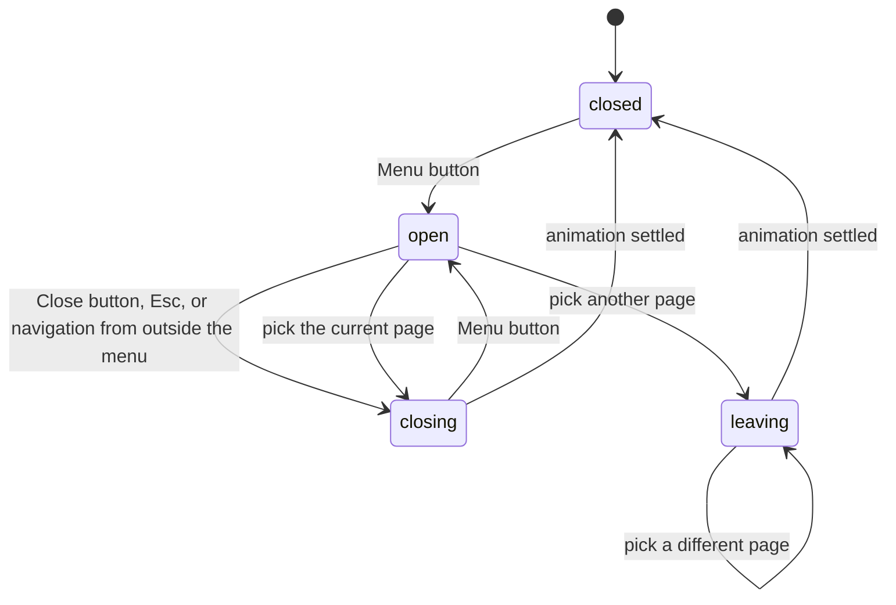

# UI conventions

How to build the interface. shadcn is the component and token base ([decision 0007](decisions/0007-shadcn-component-and-token-base.md)); the portfolio's own design system sits on top ([decision 0002](decisions/0002-portfolio-design-tokens.md)). The visual direction is clean and minimal: typography-led, generous whitespace, restrained color ([intent](intent.md#audience-and-tone)).

## Styles and tokens

1. [../src/styles/portfolio.css](../src/styles/portfolio.css): the Rence Portfolio design system. Palette (`--ink-black`, `--paper`, `--steel-grey`, `--dim-grey`), semantic roles (`--surface`, `--text`, `--text-muted`, `--rule`, `--focus`…), type scale, fonts, layout utilities.
2. [../src/styles.css](../src/styles.css): the shadcn entry. Its light variables point at the portfolio roles (`--background: var(--surface)`, `--primary: var(--surface-accent)`, `--border: var(--rule-soft)`, `--ring: var(--focus)`).
3. Feature-specific CSS goes in `src/styles/`, for example `intro.css`.

| Need | Use |
| --- | --- |
| Page ground, text, muted text | `bg-background`, `text-foreground`, `text-muted-foreground` |
| Emphasis by inversion | `bg-primary text-primary-foreground`, or `bg-ink text-paper` |
| Footer and inverse blocks | `bg-inverse text-inverse-foreground`, secondary text `text-inverse-muted` |
| Hairlines | `border-rule` (primary), `border-rule-soft` (secondary); `border` = 1px, `border-2` = heavy rule |
| Ghost display type (24px+ only) | `text-subtle` |
| Display and reading type | `text-display-xl`, `text-display-l`, `text-display-m`, `text-heading-l`, `text-heading-m`, `text-heading-s`, `text-lead`, `text-body`, `text-body-s` |
| Geist Mono data styles | `type-label` (eyebrows, nav, buttons), `type-meta` (dates, tech lists), `type-index` (counters), or `font-label` |
| Layout | `page-grid` (4 columns on phones, 12 from `md`), `max-w-grid` (1440px) |
| Motion | `ease-swiss` with `duration-150`/`200`/`300`; longer moves only where recorded, such as the [site menu](#site-menu) |

- Each `text-*` size token carries line height, tracking, and weight. Display sizes are fluid with `clamp()`; other sizes step up at 768px.
- Spacing uses Tailwind's default 4px scale (`p-4` = 16px).
- Base styles: `body` uses `text-body`; `h1`, `h2`, `h3` use `text-display-l`, `text-heading-l`, `text-heading-m`.
- Use `rounded-none` in portfolio components. The design system is square; shadcn primitives keep their radius.
- When adding a `--text-*` token, also register it in `cn()` in [../src/lib/utils.ts](../src/lib/utils.ts), or `tailwind-merge` may drop it as a colour class.
- Use semantic tokens, not raw colors or arbitrary values.
- Build for light mode only for now. The `.dark` block in `src/styles.css` is unused until dark mode is designed ([intent](intent.md#answered-questions)).

Add primitives with the shadcn CLI into `src/components/ui/` and reuse them, such as [button.tsx](../src/components/ui/button.tsx). After any CLI run, diff `src/styles.css` and restore the `var(--role)` lines if the CLI overwrote them.

## Design-system linting

`bun --bun run lint:ds` runs Oxlint with `@shadcn/lint` ([decision 0001](decisions/0001-oxlint-for-design-system-lint.md)). Rules to consider enabling: `no-arbitrary-values`, `no-raw-colors`, `no-unknown-classes`, `no-inline-styles`, `require-static-classes`, and `no-restyle` (turned off for `src/components/ui/**`). See the [rule reference](https://github.com/shadcn-ui/lint/blob/main/README.md#rules). Choosing rules is a design decision; record it in [decisions](decisions/README.md).

## Homepage plan

Sections live in `src/features/public/components/landing/`; shared chrome (navbar, footer) in `src/components/`.

| Section | Content |
| --- | --- |
| Hero | Name, role, and a short lead. The owner writes the copy. Revealed after the intro curtain. |
| Description | Who the owner is, in a few sentences |
| Featured projects | 3 projects in `featuredRank` order, each linking to its case study |
| Top skills | 3 skill categories in `topRank` order, linking to `/skills` |
| Contact | LinkedIn and GitHub links, and a resume download (`public/resume.pdf`) |
| Navbar | The `wends.dev` wordmark and a Menu button that opens the [site menu](#site-menu) |

For every page: check keyboard focus, heading order, image alt text, and small-screen layout.

## Intro curtain

A paper curtain plays once per browser tab before the page shows.

- GSAP through [../src/lib/gsap.ts](../src/lib/gsap.ts), which registers the `swiss` and `curtain` eases.
- An inline head script reads `sessionStorage["intro-seen"]` before paint and sets `data-intro` to `play` or `seen`, so a reload in the same tab skips the intro.
- A counter runs `000` to `100` with a progress bar, then the curtain lifts. Timing constants live in `intro.ts`.
- While it plays, the page behind is `inert` and scroll is locked.
- Reduced motion fades the curtain instead of sliding it.
- With JavaScript off, the curtain stays hidden. A CSS fallback hides it after 10 seconds if the app never starts.

Planned: the hero reveal after the curtain lifts (name, role, lead with an inverted highlight, heavy rule, meta row). When changing the intro, check reload in the same tab, a new tab, reduced motion, JavaScript off, scroll and focus after the curtain, and mobile overflow.

## Site menu

The public navbar is a fixed bar at every width: the `wends.dev` wordmark on the left links to `/`, and a **Menu** button on the right opens a full-screen ink menu listing **home**, **skills** and **projects**. Linear WD-53 holds the full spec, the timing table and the acceptance criteria, and links the design canvas. Owner decisions from 2026-10-06 are recorded there.

- **State:** a zustand store in `src/features/public/utils/` with the phases above ([decision 0013](decisions/0013-zustand-for-client-ui-state.md)). Its actions guard the transitions; GSAP timelines call `settled` when they finish. Unit-test the store and the current-page helpers.
- **Where code goes:** the bar in `src/components/Navbar.tsx`; the overlay in `src/features/public/components/`; the store, page list, timing constants and helpers in `src/features/public/utils/`.
- **Motion:** GSAP through [../src/lib/gsap.ts](../src/lib/gsap.ts): `swiss` for type and washes, `curtain` for the ink panel. Animate transform, opacity and `clip-path`; the bar's text colour turning paper as the ink passes is the one colour fade.
- **Motion exception:** the curtain (560–640ms) and the rising page names (720ms) are longer than the 150–300ms used elsewhere. The exception covers the menu and the section page transition (Linear WD-51) only; do not copy these durations into ordinary components.
- **Current page:** the link whose path matches the page exactly gets `aria-current="page"`. A paper dot marks the current section, the first path segment. Picking the current page only closes the menu; picking **projects** on `/projects/<slug>` navigates to `/projects`.
- **Picking a page:** the router navigates while the panel covers the screen. If the route is still loading, the panel waits for it. Scroll is at the top before the curtain lifts. A pick of another page during a pick cancels the pending steps and runs toward the newest target.
- **Section transition:** WD-51 reads the store to tell a menu pick (phase `leaving`) from other navigation; a pick joins WD-51 at its step 4 and skips the title card.
- **Content:** no contact links and no resume in the menu; the homepage carries them ([intent](intent.md#site-structure)). The bottom row holds only an "Esc to close" hint, from `md` up.
- **Accessibility:** the button has `aria-expanded` and `aria-controls`, and its accessible name is "Open menu" or "Close menu" (phones show only the two lines). The menu is a `nav` labelled "Site". While it is open, the page behind is `inert` and scroll is locked, as with the intro curtain. Focus moves to the first link on open and back to the button on close; Esc closes. Reduced motion runs on opacity alone. Touch targets are at least 44px; focus rings use `focus` on paper and `focus-inverse` on ink.

When changing the menu, check it with the keyboard only, with Esc, with reduced motion, at phone width, with a pick during a pick, with back and forward while it is open, and with a slow route load.
